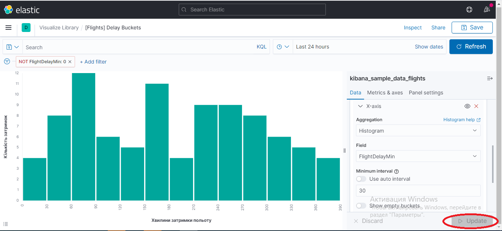

# Elasticsearch
Elasticsearch - це потужний пошуковий движок, що дозволяє організувати ефективний пошук в базі даних. 


Основним призначенням Elasticsearch є складний повнотекстовий пошук в базі з урахуванням морфології мови, контролем помилок і ранжуванням результатів за релевантністю.

Elasticsearch являє із себе noSQL базу даних з керуванням через HTTP запити і щільною інтеграцією з системою візуалізації даних (Kibana), системою збору подій і логів (Logstash) і різними інструментами аналізу даних.

## Хто використовує Elasticsearch
Завдяки широкому набору функціональних можливостей, особливо повнотекстовому пошуку по безлічі мов і аналітиці в реальному часі, Elasticsearch активно застосовується в різних Big Data системах великих та середніх підприємств по всьому світу. З найбільш відомих зарубіжних користувачів варто відзначити корпорації Netflix, IBM, Facebook, Amazon, GitHub, Wikimedia, CERN, Volkswagen, Microsoft, Mozilla, Adobe.

## Приклади використання Elasticsearch
* Реалізація пошуку по веб-сайту, наприклад пошук товарів в інтернет-магазині. В цьому випадку Elasticsearch індексує каталоги товарів, та надає можливості пошуку та припущення щодо автозаповнення.
* Зберігання журналів подій чи транзакцій, аналізування і добування даних для отримання тенденцій, статистик, висновків, аномалій. В даному випадку можна використовувати Logstash для збору, об'єднання, аналізу даних, і потім перенаправляти ці дані в Elasticsearch для подальшого опрацювання.
* Для розробки, наприклад, платформи по ціновому оповіщенню, що дозволяє досвідченим в цій сфері користувачам визначати правила типу «Я зацікавлений в придбанні електронного ґаджету XXX і я хочу бути оповіщеним якщо ціна у будь-якого постачальника впаде нижче XXX протягом наступного місяця». В даному випадку можна збирати ціни, індексувати їх в Elasticsearch і використовувати функцію зворотнього пошуку: зіставляти коливання цін з запитом користувача і при відповідності до запиту надсилати сповіщення.
* Для впровадження аналітики/Бізнес-аналітики в проект, коли треба швидко досліджувати, аналізувати, візуалізувати надзвичайно великі об'єми даних (мільйони чи мільярди записів). В даному випадку доцільно використання Elasticsearch для збереження даних і Kibana для побудови користувацьких панелей відображення і візуалізації необхідних аспектів. До того ж, можна використовувати агрегаційні функції Elasticsearch для здійснення комплексної бізнес-аналітики даних.

Elasticsearch розробляється компанією Elastic разом з пов'язаними проектами, званими Elastic Stack, - Elasticsearch, Logstash, Beats і Kibana.

Beats - легковагі агенти і відправники даних з різних пристроїв. Logstash збирає і обробляє дані зареєстрованих подій. За зберігання і пошук даних відповідає Elasticsearch. Kibana візуалізує дані через web-інтерфейс.

# Kibana


Kibana - це інструмент візуалізації, який створюється в журналах Elasticsearch і може відображати їх користувач у відео лінійного графіку, гістограмми, кругові діаграми та інше.
Elasticsearch працює як база даних, в якій збираються дані, і Kibana використовує дані з Elasticsearch для представлення даних користувачів, що містяться у вигляді гістограм, кругових діаграм, теплових карт, як показано нижче


## Переваги Kibana
Kibana пропонує наступні переваги для своїх користувачів:

* Зберігає інструмент візуалізації на основі браузера з відкритим вихідним кодом, який в основному використовується для аналізу великого обсягу журналів у відеолінійному графіці, гістограммах, кругових діаграмах, теплових картках і т.д.

* Просто і легко зрозуміти починаючим.

* Простота перетворення візуалізації та панелей інструментів у віджетах.

* Візуалізація холста допомагає легко аналізувати складні дані.

* Візуалізація Timelion в Кібані допомагає порівняти дані в обраному напрямку, щоб краще зрозуміти продуктивність.

# Dashboard-и в Kibana

## Візуалізація даних
Найкращий спосіб зрозуміти ваші дані - це візуалізувати їх. За допомогою dashboard-ів ви можете перетворити свої дані з одного або декількох шаблонів індексу на колекцію панелей, які вносять чіткість у ваші дані, розповідають історію про ваші дані та дозволяють зосередитись лише на важливих для вас даних. Dashboard-и дають можливість налаштувати кожну панель для відображення ваших даних на діаграмі, таблиці, карті тощо, а потім порівняти панелі поруч, щоб визначити закономірності та зв’язки у ваших даних

Dashboard-и підтримують багато типів панелей і мають кілька редакторів, які можна використовувати для створення панелей.

## Типи dashboard-ів

+ **Visualization editors** — використовує редактори Lens, TSVB, Vega та Timelion, щоб допомогти вам створити візуалізації ваших даних або створити візуалізації на основі агрегування за допомогою агрегувань Elasticsearch. Lens рекомендується для більшості користувачів.
+ **Maps** — створює чудові зображення ваших географічних даних.
+ **Tools** — додає контекст до ваших панелей за допомогою тексту або додайте динамічні фільтри за допомогою елементів керування.
+ **Saved search from Discover** — відображення збереженої таблиці пошуку з Discover. Результати таблиці не агрегуються.
+ **Log stream** — відображення таблиці журналів потокової трансляції.
+ **ML Anomaly Swim Lane** — відображення результатів завдань виявлення аномалій машинного навчання.

# Дослідження Kibana та dashboard-ів, використовуючи _Sample flight data_

## Додавання зразкових даних
Для створення dashboard-ів будемо використовувати логи та дані польотів Kibana _"Sample flight data"_.
Дл цього необхідно встановити Flights sample data set таким чином:
1. Перейти за адресою http://localhost:5601 на домашню сторінку та натиснути: `Try our sample data`


2. Натиснути `add data`, яка після завантаження перетвориться у `view data`
3. Натиснути `view data`


Набір польотних даних містить дані про чотири авіакомпанії. Ви можете завантажувати дані та попередньо налаштовані інформаційні панелі з домашньої сторінки Kibana.

Ви потрапили на  _Global Flight dashboard_ - колекцію діаграм, графіків, карт та інших візуалізацій даних в індексі `kibana_sample_data_flights`.

## Фільтрування даних
Багато візуалізацій на і _Global Flight dashboard_ є інтерактивними. Ви можете застосувати фільтри для зміни подання даних у всіх візуалізаціях.
1. У візуалізації **Controls** встановіть місто походження _"Origin City"_ та місто-ціль _"Destination City"_.
2. Натисніть **Apply change**
<br>Поля `OriginCityName` і `DestCityName` фільтрують дані на dasbhoard-і відповідно до вказаних вами даних.
<br>Наприклад, на наступному dashboard-і відображаються дані про рейси з Лондона до Мілана.


3. Щоб додати фільтр вручну, натисніть **"Add a Filter"** , а потім вкажіть дані, які потрібно переглянути.
4. Щоб видалити фільтр, у візуалізації **Controls** натисніть **"Clear form"** і знову натисніть **"Apply changes"**.

## Дані запиту
Ви можете ввести запит Elasticsearch, щоб звузити подання даних.
1. Щоб знайти всі рейси з Риму, введіть цей запит на панелі запитів і натисніть **Update**: 
`OriginCityName：Rome`
2. Для більш складного запиту за допомогою AND та OR спробуйте наступне: <br>
```OriginCityName:Rome AND (Carrier:JetBeats OR "Kibana Airlines")```
<br>Dashboard оновлюється, щоб відображати дані про польоти з Риму на JetBeats та Kibana Airlines.


3. Закінчивши вивчати dashbord, видаліть запит, очистивши вміст на панелі запитів і натиснувши кнопку **Update**

Зазвичай фільтри працюють швидше за запити.
### Порада
У Kibana є експериментальна функція автозаповнення, яка допомагає швидко розпочати роботу. Щоб увімкнути цю функцію, натисніть праворуч на панелі запитів **Options**, а потім увімкніть. Коли ввімкнено автозавершення, під час введення запиту відображаються пропозиції пошуку.

## Discover
У Discover ви маєте доступ до кожного документа в кожному індексі, який відповідає обраному шаблону індексу. Шаблон індексу повідомляє Kibana, який індекс Elasticsearch ви зараз вивчаєте. Ви можете подавати пошукові запити, фільтрувати результати пошуку та переглядати дані документа.

1. У меню натисніть **Discover**.
2. Переконайтеся, що `kibana_sample_data_flights` є поточним шаблоном індексу. Можливо, для оновлення даних потрібно буде натиснути **New** у рядку меню. <br>
На наступному малюнку зображена гістограму, яка показує розподіл документів у часі. У таблиці перелічені поля для кожного відповідного документа. За замовчуванням відображаються всі поля.


3. Щоб вибрати, які поля відображати, наведіть вказівник миші на список **Available fields**, а потім натисніть **Add** біля кожного поля, яке потрібно включити як стовпець у таблицю.<br>
Наприклад, якщо ви додаєте поля `DestAirportID` і `DestWeather`, дисплей включає стовпці для цих двох полів.


## Редагування візуалізацій
У вас є дозволи на редагування для dashboard-у **Global Flight**, тому ви можете змінити зовнішній вигляд та поведінку візуалізацій. Наприклад, ви можете побачити, яка авіакомпанія має найнижчі середні тарифи.

1. У бічній навігаційній панелі клацніть **Recently viewed** та відкрийте **Global Flight Dashboard**.
2. У рядку меню натисніть **Edit**.
3. У візуалізації **Average Ticket Price** натисніть значок шестірні у верхньому правому куті.
4. У меню **Options** виберіть **Edit visualization**.

**Average Ticket Price** - це метрична візуалізація. Щоб вказати, які групи відображати в цій візуалізації, ви використовуєте _bucket aggregation_ Elasticsearch. Цей агрегація сортує документи, які відповідають вашим критеріям пошуку, за різними категоріями або сегментами.

### Створення _bucket aggregation_ або _агрегації сегментів_
1. На панелі **Buckets** виберіть **Add > Split group**.
2. У спадному меню **Aggregation** виберіть умови **Terms**.
3. У спадному меню  поле **Field** виберіть **Carrier**.
4. Встановіть за спаданням **Descending** значення **4**.
5. Натисніть кнопку **Apply changes**

На малюнку нижче можно побачити середню ціну квитка для всіх чотирьох авіакомпаній.


### Збереження візуалізації

1. У рядку меню натисніть **Save**.
2. Залиште ім'я візуалізації незмінним, як і було і підтвердьте збереження.
3. Перейдіть до dashboard-у **Global Flight** і прокрутіть візуалізацію **Average Ticket Price**, щоб побачити чотири ціни.
4. За бажанням відредагуйте інформаційну панель. Змініть розмір панелі для візуалізації **Average Ticket Price**, перетягнувши ручку внизу праворуч. Ви також можете переставити візуалізацію, натиснувши на заголовок і перетягнувши. Обов’язково збережіть панель інструментів.
5. У рядку меню натисніть **Save**, а потім підтвердьте збереження.


## Перевірка даних
Перегляд візуалізації ваших даних - це чудово, але іноді вам потрібно поглянути на фактичні дані, щоб зрозуміти, що насправді відбувається. Ви можете перевірити дані за будь-якою візуалізацією та переглянути запит Elasticsearch, який використовується для їх отримання.

1. На dashboard-і наведіть вказівник на секторну діаграму **Airlines Carrier**, а потім клацніть піктограму у верхньому правому куті.
2. У меню параметри **Options** виберіть перевірити **Inspect**.
Початковий вигляд показує кількість документів.

3. Щоб переглянути запит, який використовується для отримання даних для візуалізації, виберіть **View > Requests** у верхньому правому куті області Перевірити - Inspect.

## Видалення наборів даних
Закінчивши експериментувати із зразком набору даних, ви можете його видалити.
1. Перейдіть на домашню сторінку Kibana та натисніть посилання поруч із **Sample data**.
2. На карці **Sample flight data** натисніть **Remove**.

## Приклад створення dashboard-ів

Для створення dashboard-ів будемо використовувати логи та дані польотів Kibana "Sample flight data".
Як завантажити дані було показано раніше.

Щоб створити новий dashboard неохідно в лівому меню натиснути на розділ створення Dashboard. Потрапивши туди, натискаємо на «Create dashboard» і потрапляємо на сторінку додавання об'єктів у в Dashboard.


Далі натискаємо на кпопку «Create new», і система запропонує вибрати вид відображення даних. В Kibana їх досить велика кількість.


## Vertical Bar
Для прикладу створимо графічне представлення «Vertical Bar». Для цього оберемо `Lens -> Stacked bar -> Bar`.

Для демонстрації «Vertical Bar» створимо гістограму співвідношення хвилин, на які затримали польоти та кількість затриманих польотів на цей час.
Для створення графіки «Vertical Bar» нам необхідно вибрати джерело даних. Вибираємо покажчик Index Pattern, який створених за дефолтом у "Sample flight data".


За замовчуванням, після вибору джерела даних з'являється один загальний графік. Налаштуємо его.

У блоці «Buckets» натиснемо кнопку «Add», виберемо «X-asis» і налаштуємо вісь Х. Відкладемо по ней тимчасові позначки вступу записів у лог. У поле «Aggregation» вибираємо «Histogram», а в «Field» вибираємо «FlightDelayMin», тобто по осі Х відкладаємо часові затримки польотів. «Minimum interval» запишемо як 30, тобто будемо рахувати кількість затримок на 0, 30, 60 і т.д. хвилин. У «Custom label» встановимо піпдис для осі Х.


Налаштовувати гістограму по осі Y нам не потрібно, оскільки за замовчуванням у нас відображається загальне число затримок на певну кількість хвилині, що нам і потрібно. Можемо лише у «Custom label» встановити піпдис для осі Y.


В результаті отримуємо таку гістограму:


Далі нам потрібно відфільтрувати польоти, які не затримували. Для цього використаємо фільтр. Натискаємо на кнопку «Add filter». У полі «Field» вибираємо «FlightDelayMin», у полі «Operation» вибираємо «is not» (не є), у полі «Value» пишемо «0». Натискаємо на кнопку «Save», щоб зберети.


Якщо дані не оновилися, натискаємо кнопку «Update», яка знаходиться у правому нижньому кутку екрану.

В результаті маємо таку кінцеву гістограму:



# Матеріал підготувала 
Cтудентка групи ІВ-91
<br> *Яременко Влада* - [wladziaya](https://github.com/wladziaya)

