# Git

Git — розподілена система керування версіями (СКВ) файлів та спільної роботи. А що ж таке СКВ?
Система контролю версій - це система, що записує зміни у файл або набір файлів протягом деякого часу,
так що ви зможете повернутися до певної версії пізніше.

## Основні стани git

Git має три основних стани, в яких можуть перебувати ваші файли: 
* Збережений у коміті (**comitted**) означає, що дані безпечно збережено в локальній базі даних.
* Змінений (**modified**) означає, що у файл внесено редагування, які ще не збережено в базі даних.
* Індексований (**staged**) стан виникає тоді, коли ви позначаєте змінений файл у поточній версії,
щоб ці зміни ввійшли до наступного знімку коміту.

## Робоча директорія, індекс та директорія Git

У директорії Git система зберігає метадані та базу даних об’єктів вашого проекту. Це найважливіша частина Git,
саме вона копіюється при клонуванні сховища з іншого комп’ютеру.
Робоче дерево — це одна окрема версія проекту, взята зі сховища. Ці файли видобуваються з бази даних
у теці Git та розміщуються на диску для подальшого використання та редагування.
Індекс — це файл, що зазвичай знаходиться в директорії Git і містить інформацію про те, що буде 
збережено у наступному коміті. Також цей файл називають “областю додавання” (staging area), проте ми переважно будемо користуватись технічним терміном Git “індекс”.


Найпростіший процес взаємодії з Git виглядає приблизно так:
1. Ви редагуєте файли у своїй робочій директорії.
2. Вибірково надсилаєте до індексу лише ті зміни, що їх ви бажаєте зберегти в наступному коміті, 
і лише ці зміни буде збережено в індексі.
3. Створюєте коміт: знімок з індексу остаточно зберігається в директорії Git.

## Інсталяція git

### Інсталяція на Linux

Якщо, наприклад, ви використовуєте Fedora (чи будь-який споріднений дистрибутив на базі RPM на кшталт RHEL чи CentOS), 
скористайтеся `dnf`:

`$ sudo dnf install git-all`

Якщо ви використовуєте Debian-подібний дистрибутив, такий як Ubuntu, спробуйте `apt-get`:

`$ sudo apt-get install git-all`

### Інсталяція на Mac

Є декілька способів установки Git на Mac. Найпростіше, встановити Xcode Command Line Tools. На Mavericks (10.9)
або вище, ви можете зробити це просто перший раз виконавши `git` з терміналу.

`$ git --version`

Якщо його досі не встановлено, вам буде запропоновано встановити його.

Якщо ви бажаєте більш свіжу версію, зробіть це за допомогою бінарного інсталятору. Інсталятор для macOS Git 
підтримується та доступний для завантаження на сайті Git http://git-scm.com/download/mac.

### Інсталяція на Windows

Є декілька шляхів встановити Git під Windows. Офіційна збірка доступна для завантаження з сайту Git. 
Просто перейдіть до http://git-scm.com/download/win і завантаження почнеться автоматично.

Щоб встановлення було автоматичним, можете використати Git Chocolatey package: https://chocolatey.org/packages/git.

Ще один простий спосіб встановити Git це встановити GitHub для Windows. 
Установка включає версію командного рядка Git та графічну теж. 
Ви можете завантажити GitHub для Windows за адресою http://windows.github.com.
Інтерфейс цього застосунку можна побачити нижче.

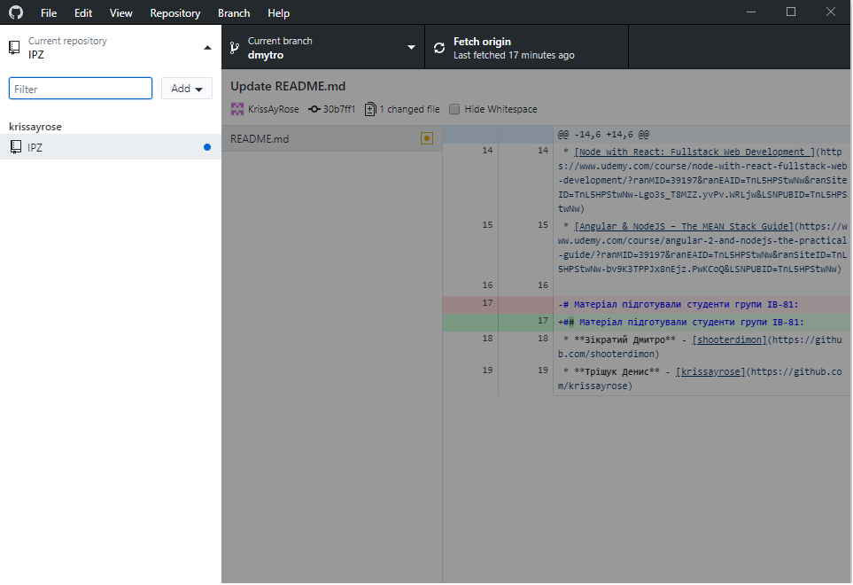

### Налаштування ім’я користувача

Перше, що ви повинні зробити, коли ви інсталюєте Git - це встановити ім’я користувача та адресу електронної пошти.
Це важливо, тому що кожен коміт в Git використовує цю інформацію, і вона незмінно включена у комміти, які ви робите:

`$ git config --global user.name "John Doe"`

`$ git config --global user.email johndoe@example.com`

Знову ж таки, якщо ви передаєте опцію `--global`, ці налаштування потрібно зробити тільки один раз, тоді Git
завжди буде використовувати цю інформацію для всього, що ви робите у цій системі. Якщо ви хочете, перевизначити
ім’я або адресу електронної пошти для конкретних проектів, ви можете виконати цю ж команду без опції `--global`
в каталозі необхідного проекту. Багато з графічних інструментів допомагають зробити це при першому запуску.

### Перевірка налаштувань

Якщо ви хочете подивитися на свої налаштування, можете скористатися командою `git config --list`,
щоб переглянути всі налаштування, які Git може знайти:
```
$ git config --list
user.name=John Doe
user.email=johndoe@example.com
color.status=auto
color.branch=auto
color.interactive=auto
color.diff=auto
...
```
Ви також можете перевірити значення конкретного ключа виконавши `git config <key>`:

```
$ git config user.name
John Doe
```

## Створення Git-репозиторія

Зазвичай Git репозиторій отримують одним з двох способів:

1. Беруть локальну директорію, що наразі не під контролем версій, та перетворюють її на сховище Git.

2. Звідкілясь клонують існуючий Git репозиторій.

У будь-якому разі ви отримуєте на локальній машині готове до роботи Git сховище.

### Ініціалізація репозиторія в існуючому каталозі

Якщо у вас вже є тека з проектом, що наразі не перебуває під контролем версії, і ви бажаєте почати використовувати з цим проектом Git,
спочатку треба перейти до теки цього проекту. 
Якщо ви ніколи ще цього не робили, команда може трохи відрізнятися в залежності від вашої системи:

для Linux:

`$ cd /home/user/my_project`

для Mac:

`$ cd /Users/user/my_project`

для Windows:

`$ cd /c/user/my_project`

Я працюю на ОС Windows і використовую Git Bash, нижче наведено шлях до теки з проектом:

`$ cd PycharmProjects/IPZ_example/`

У разі успішного переходу до теки з проектом, у консолі буде відображено поточну теку:

`Dima@DESKTOP-DTBVT0A MINGW64 ~/PycharmProjects/IPZ_example (master)`

Після переходу виконуєм:

`$ git init`

Після успішної ініціалізації:

`Initialized empty Git repository in C:/Users/Dima/PycharmProjects/IPZ_example/.git/`

Це створить новий підкаталог .git, який містить всі необхідні файли вашого репозиторія — скелет 
Git-репозиторія. На цей момент, у вашому проекті ще нічого не відстежується.

Якщо ви бажаєте додати існуючі файли під версійний контроль вам слід проіндексувати ці файли і зробити 
перший коміт. Ви можете це зробити за допомогою декількох команд `git add`, що визначають файли, за якими 
ви бажаєте слідкувати, після яких треба виконати `git commit`:

Додамо всі файли з розширенням `.с`

`$ git add *.c`

Додамо файл з ім'ям main.py

`git add main.py`

Зробимо перший коміт:

`$ git commit -m 'Перша версія проекту'`

## Клонування існуючого репозиторія

Якщо ви бажаєте отримати копію існуючого Git репозиторія — наприклад, 
проекту, в якому ви хочете прийняти участь — вам потрібна команда `git clone`.

Щоб клонувати репозиторій треба використати команду `git clone <url>`. Наприклад, 
якщо ви бажаєте зробити клон репозиторію-прикладу IPZ_example, ви можете це зробити так:

`$ git clone https://github.com/shooterdimon/IPZ_example`

Клонування у консолі супроводжуватиметься таким текстом:
```
Cloning into 'IPZ_example'...
remote: Enumerating objects: 5, done.
remote: Counting objects: 100% (5/5), done.
remote: Compressing objects: 100% (2/2), done.
remote: Total 5 (delta 0), reused 5 (delta 0), pack-reused 0
Unpacking objects: 100% (5/5), done.
```

Це створить директорію під назвою `IPZ_example`, проведе ініціалізацію директорії `.git`, 
забере всі дані для репозиторія, та приведе директорію до стану останньої версії. 
Якщо ви зайдете до щойно створеної директорії `IPZ_example`, ви побачите, що всі файли 
проекту на місці, готові для використання.

Якщо ви бажаєте зробити клон репозиторія в директорію з іншою назвою, ви можете передати 
її як другий параметр команди:

`$ git clone https://github.com/shooterdimon/IPZ_example myIPZ_exmple`

Таким чином створиться директорія під назвою `myIPZ_example`

## Запис змін до репозиторія

кожен файл вашої робочої директорії може бути в одному з двох станів: контрольований (tracked) 
чи неконтрольований (untracked). Контрольовані файли — це файли, що були в останньому знімку. 
Вони можуть бути не зміненими, зміненими або індексованими. Якщо стисло, контрольовані файли — це 
файли, про які Git щось знає.

Неконтрольовані файли — це все інше, будь-які файли у вашій робочій директорії, що не були у вашому 
останньому знімку та не існують у вашому індексі. Якщо ви щойно зробили клон репозиторія, усі ваші 
файли контрольовані та не змінені, адже Git щойно їх отримав, а ви нічого не редагували.

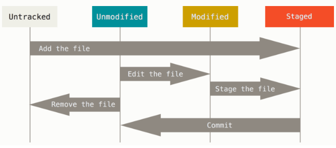

### Перевірка статусу ваших файлів
Щоб дізнатись, в якому стані ваші файли, варто скористатись командою `git status`. Якщо ви виконаєте 
цю команду відразу після клонування, ви маєте побачити таке:

```
$ git status
On branch master
Your branch is up-to-date with 'origin/master'.
nothing to commit, working directory clean
```

Це означає, що ваша робоча директорія чиста — іншими словами, жоден з контрольованих файлів не змінено. 
Git також не бачить неконтрольованих файлів, інакше він би їх тут вказав. Нарешті, ця команда показує 
вам, в якій ви зараз гілці та інформує вас про те, що вона не розбіглася з такою ж гілкою на сервері. 
Поки що, ця гілка завжди буде “master”, така гілка створюється автоматично.

Припустімо, ви додали новий файл до вашого проекту, простий файл `README.md`. Якщо файл раніше не існував, 
і ви виконаєте `git status`, ви побачите ваш неконтрольований файл так:

```
$ touch README.md
$ git status
On branch master
Your branch is up to date with 'origin/master'.

Untracked files:
  (use "git add <file>..." to include in what will be committed)

        ../../.idea/
        README.md
        requirements.txt
        ../Lib/
        ../Scripts/
        ../pyvenv.cfg

nothing added to commit but untracked files present (use "git add" to track)

```

Ви можете бачити, що ваш новий файл README.md неконтрольований, адже він під заголовком
“Untracked files” у статусі. Неконтрольований (untracked) означає, що Git бачить файл, 
якого нема у попередньому знімку (коміті). Git не почне включати його до ваших комітів 
доки ви явно не скажете йому це зробити. Так зроблено щоб ви випадково не почали включати 
генеровані бінарні файли чи інші файли, які ви не збирались включати. 

### Контролювання нових файлів

Щоб почати контролювати новий файл, вам треба використати команду `git add`. Почати контролювати 
файл README.md можна так:

`$ git add README.md`

Якщо ви знову виконаєте команду status, ви побачите, що ваш файл README.md тепер контролюється та 
готовий до включення до коміту:
```
$ git status
On branch master
Your branch is up to date with 'origin/master'.

Changes to be committed:
  (use "git reset HEAD <file>..." to unstage)

        new file:   README.md

Untracked files:
  (use "git add <file>..." to include in what will be committed)

        ../../.idea/
        requirements.txt
        ../Lib/
        ../Scripts/
        ../pyvenv.cfg

```

Ви можете зрозуміти, що цей файл доданий, бо він під заголовком “Changes to be committed”. 
Якщо ви створите коміт зміни зараз, версія файлу на момент коли ви виконали `git add` буде 
збережена в знімку в історії. Ви можете пригадати, що коли ви виконали `git init` раніше, 
ви потім виконали `git add <файли>` — це було зроблено щоб розпочати контролювати файли у 
вашій директорії. Команда git add приймає шлях файлу або директорії. Якщо це директорія, 
команда додає усі файли в цій директорії рекурсивно.

### Індексування змінених файлів

Змінімо файл, що вже контролюється. Якщо ви зміните файл main.py, що вже 
контролюється, та потім виконаєте команду `git status` знову, ви отримаєте щось на кшталт:

```
$ git status
On branch master
Your branch is up to date with 'origin/master'.

Changes to be committed:
  (use "git reset HEAD <file>..." to unstage)

        new file:   README.md

Changes not staged for commit:
  (use "git add <file>..." to update what will be committed)
  (use "git checkout -- <file>..." to discard changes in working directory)

        modified:   main.py

Untracked files:
  (use "git add <file>..." to include in what will be committed)

        ../../.idea/
        requirements.txt
        ../Lib/
        ../Scripts/
        ../pyvenv.cfg

```

Файл `main.py` з’явився під секцією названою “Changes not staged for commit” — це означає, 
що контрольований файл був редагований у робочій директорії проте його не індексували. Щоб 
проіндексувати його, виконайте команду `git add`. `git add` багатоцільова команда — її слід 
використовувати щоб почати контролювати нові файли, щоб додавати файли, та для інших речей, 
наприклад позначання конфліктних файлів як розв’язаних.

Виконаймо `git add` зараз для індексації файлу main.py, а потім знову виконаємо `git status`:

```
$ git add main.py
$ git status
On branch master
Your branch is up to date with 'origin/master'.

Changes to be committed:
  (use "git reset HEAD <file>..." to unstage)

        new file:   README.md
        modified:   main.py

Untracked files:
  (use "git add <file>..." to include in what will be committed)

        ../../.idea/
        requirements.txt
        ../Lib/
        ../Scripts/
        ../pyvenv.cfg
```

Обидва файли індексовані та будуть включені до наступного коміту. Припустімо, що саме 
зараз ви пригадали маленьку зміну, яку ви хочете зробити в `main.py` до того, як 
зробити коміт з ним. Ви знову його відкриваєте та редагуєте, і ви готові зробити коміт. 
Втім, виконаймо `git status` ще раз:

```
$ git status
On branch master
Your branch is up to date with 'origin/master'.

Changes to be committed:
  (use "git reset HEAD <file>..." to unstage)

        new file:   README.md
        modified:   main.py

Changes not staged for commit:
  (use "git add <file>..." to update what will be committed)
  (use "git checkout -- <file>..." to discard changes in working directory)

        modified:   main.py

Untracked files:
  (use "git add <file>..." to include in what will be committed)

        ../../.idea/
        requirements.txt
        ../Lib/
        ../Scripts/
        ../pyvenv.cfg

```

Тепер `main.py` є як в індексованих, так і в неіндексованих. Як таке можливо? 
Виявляється, що Git індексує файл саме таким, яким він був, коли ви виконали команду 
`git add`. Якщо ви зараз створите коміт, в історії збережеться версія `main.py`, 
яка була коли ви востаннє викликали `git add`, а не поточна версія файлу з вашої робочої 
директорії, коли ви виконаєте `git commit`. Якщо ви зміните файл після того, як виконаєте 
`git add`, вам треба знову виконати git add щоб проіндексувати останню версію файлу

### Короткий статус

Хоча вивід `git status` доволі вичерпний, він також дещо довгий. Git також пропонує опцію 
короткого перегляду статусу, щоб ви могли побачити свої зміни в більш компактному вигляді. 
Якщо ви виконаєте `git status -s` або `git status --short`, ви отримаєте набагато простіший вивід:

```
$$ git status -s
 M README.md
MM main.py
A  requirements.txt
?? ../../.idea/
?? ../Lib/
?? ../Scripts/
?? ../pyvenv.cfg
```
Нові неконтрольовані файли позначаються `??`, нові індексовані файли позначаються `A`, 
змінені файли позначаються `M` тощо. Результат має дві колонки – ліва містить статус 
індексу, а права містить статус робочої теки. Наприклад у цьому виводі, файл `README.md` 
змінений у робочій директорії, проте не індексований, а файл `requirements.txt` тільки доданий і 
індексований. `main.py` був змінений, індексований та знову змінений, тому є зміни в обох колонках.

### Ігнорування файлів

Буває, що у вас є клас файлів, що ви не хочете щоб Git їх автоматично індексував чи навіть відображав 
як неконтрольовані. Зазвичай це автоматично згенеровані файли, наприклад файли логів або файли вироблені 
вашою системою збірки. У таких випадках, ви можете створити файл `.gitignore`, що містить зразки, яким 
відповідають ці файли. Ось приклад файлу `.gitignore`:

```
$ cat .gitignore
.idea/
```
Перший рядок каже Git ігнорувати директорію `.idea`

Заповнення файлу `.gitignore` вашого нового сховища до початку праці зазвичай гарна думка, адже це допоможе вам випадково не додати файли, які ви не хочете додавати до репозиторія Git.

Правила для взірців, які ви можете додати до файлу `.gitignore`:

* Порожні рядки та рядки, що починаються з `#`, ігноруються.

* Стандартні ґлоб взірці працюють, і будуть застосовані для всього робочого дерева рекурсивно.

* Ви можете почати взірець з прямої похилої риски (`/`) щоб уникнути рекурсії.

* Ви можете завершити взірець похилою рискою (`/`) щоб позначити директорію.

* Ви можете відкинути взірець, якщо почнете його зі знаку оклику (`!`).

Ґлоб (glob) взірці – це ніби спрощені регулярні вирази, що їх використовують оболонки. 
Зірочка (`*`) відповідає нулю або більше символам. `[абв]` відповідає будь-якому з символів 
всередині квадратних дужок (у цьому випадку а, б або в). Знак питання (`?`) відповідає одному 
символу. Квадратні дужки з символами, що розділені дефісом (`[0-9]`) відповідають будь-якому 
символу між ними (у даному випадку від 0 до 9). Ви можете використовувати дві зірочки щоб 
позначити вкладені директорії: `a/**/z` відповідає `a/z`, `a/b/z`, `a/b/c/z` тощо.

Ось ще один приклад файлу `.gitignore`:

```
$ cat .gitignore
# Ігнорувати директорію Lib
Lib/

# Ігнорувати директорію Lib
Scripts/

# Ігнорувати всі файли з розширенням .cfg
*.cfg
```

### Перегляд ваших доданих та недоданих змін

Якщо команда `git status` недостатньо інформативна для вас — ви хочете знати що саме ви змінили, 
а не просто які файли ви змінили — ви можете використати команду `git diff`.


```
$ git diff
diff --git a/venv/Include/README.md b/venv/Include/README.md
index e69de29..5ab2f8a 100644
--- a/venv/Include/README.md
+++ b/venv/Include/README.md
@@ -0,0 +1 @@
+Hello                          //Рядок, що був доданий
\No newline at end of file
diff --git a/venv/Include/main.py b/venv/Include/main.py
index eb7d7e7..d984313 100644
--- a/venv/Include/main.py
+++ b/venv/Include/main.py
@@ -24,3 +24,4 @@ print(polar(F1(p1)/F2d(p1)))
 print(polar(F1(p2)/F2d(p2)))

 print("")
+print()                        //Рядок, що був доданий
\No newline at end of file
```
Ця команда порівнює вашу робочу директорію з індексом. Результат 
показує вам зміни, котрі ви зробили проте не індексували.

Якщо ви хочете побачити, що ви індексували та ввійде до вашого наступного коміту, ви можете 
скористатись `git diff --staged`. Ця команда порівнює індексовані зміни з вашим останнім знімком:

```
$ git diff --staged
diff --git a/venv/Include/main.py b/venv/Include/main.py
index 1729b7a..eb7d7e7 100644
--- a/venv/Include/main.py
+++ b/venv/Include/main.py
@@ -24,4 +24,3 @@ print(polar(F1(p1)/F2d(p1)))
 print(polar(F1(p2)/F2d(p2)))

 print("")
-print("")
\No newline at end of file
diff --git a/venv/Include/requirements.txt b/venv/Include/requirements.txt
new file mode 100644
index 0000000..296d654
--- /dev/null
+++ b/venv/Include/requirements.txt
@@ -0,0 +1 @@
+numpy
\No newline at end of file
```
Важливо пам’ятати, що команда `git diff` без опцій не відображає всіх змін з останнього коміту — тільки 
неіндексовані зміни. Якщо ви проіндексували всі свої зміни, вивід `git diff` буде порожнім.

### Збереження ваших змін у комітах

Припустімо, що ваш індекс саме в стані, який ви бажаєте, та тепер ви можете створити коміт з ваших зміни. 
Пам’ятайте, що будь-які неіндексовані зміни — будь-які файли, що ви їх створили чи змінили, але ви не 
виконали `git add` після їх редагування — не потраплять до цього коміту. Вони так і залишаться зміненими 
файлами на вашому диску. У цьому випадку, припустімо, що останнього разу, коли ви виконали `git status`, 
ви побачили, що всі зміни індексовані, отже ви готові зберегти ваші зміни. Найпростіший спосіб створити 
коміт — набрати `git commit`:

`$ git commit`

Це запустить ваш редактор. (Це редактор, який встановлено в змінній середовища EDITOR вашої 
оболонки — зазвичай vim або emacs, хоча ви можете налаштувати його як завгодно за допомогою команди 
`git config --global core.editor`

Ви можете набрати повідомлення коміту прямо в команді `commit`, якщо напишете її після опції `-m`, ось так:

```
$ git commit -m "New commit"
[master 7bf49cd] New commit
 2 files changed, 1 insertion(+), 1 deletion(-)
 create mode 100644 venv/Include/requirements.txt
```
Тепер ви створили свій перший коміт! Ви можете бачити, що команда `commit` розповіла вам дещо про 
коміт: до якої гілки ви зберегли зміни (`master`), який SHA-1 хеш отримав коміт (`463dc4f`), скільки 
файлів було змінено, та статистику щодо індексованих та видалених рядків у коміті.

### Commit в один рядок

Задля того, щоб `commit проіндексував всі зміни без зайвого використання команди `git add`, використовують 
прапорець `-a` під час коміту:

`$ git commit -am "New commit"`

### Скасування речей

Одне з розповсюджених скасувань відбувається, коли ви зробили коміт зарано, можливо забули додати деякі файли, 
або ви зіпсували повідомлення коміту. Якщо ви хочете переробити цей коміт, внести до нього додаткові зміни, 
що про них ви забули, то проіндексуйте їх та створіть коміт наново за допомогою опції `--amend`:

`$ git commit --amend`

### Видаляємо файли

Щоб видалити файл з Git, вам треба прибрати його з контрольованих файлів (вірніше, 
видалити його з вашого індексу) та створити коміт. Команда git rm це робить, а також 
видаляє файл з вашої робочої директорії, щоб наступного разу він не відображався неконтрольованим.

Якщо ви просто видалите файл з вашої робочої директорії, він з’явиться під заголовком 
“Changes not staged for commit” (тобто, неіндексованим) виводу команди `git status`:

```
$ git status
On branch master
Your branch is ahead of 'origin/master' by 2 commits.
  (use "git push" to publish your local commits)

Changes not staged for commit:
  (use "git add/rm <file>..." to update what will be committed)
  (use "git checkout -- <file>..." to discard changes in working directory)

        modified:   README.md
        modified:   main.py
        deleted:    requirements.txt

Untracked files:
  (use "git add <file>..." to include in what will be committed)

        ../../.gitignore
        ../.gitignore

no changes added to commit (use "git add" and/or "git commit -a")
```
Потім, якщо ви виконаєте git rm, файл буде індексованим на видалення:

```
$ git rm requirements.txt
rm 'venv/Include/requirements.txt'
$ git status
On branch master
Your branch is ahead of 'origin/master' by 2 commits.
  (use "git push" to publish your local commits)

Changes to be committed:
  (use "git reset HEAD <file>..." to unstage)

        deleted:    requirements.txt

Changes not staged for commit:
  (use "git add <file>..." to update what will be committed)
  (use "git checkout -- <file>..." to discard changes in working directory)

        modified:   README.md
        modified:   main.py

Untracked files:
  (use "git add <file>..." to include in what will be committed)

        ../../.gitignore
        ../.gitignore
```

Наступного разу, коли ви створите коміт, файл зникне та більше не буде контрольованим. 
Якщо ви редагували файл та вже додали його до індексу, ви маєте примусово видалити його за 
допомогою опції `-f`. Це захід безпеки, щоб завадити випадковому видаленню даних, які ви не 
записали до знімку, і тому вони не можуть бути відновлені Git.

Інша корисна річ, яку ви можливо захочете зробити, це зберегти файл у робочій директорії, 
проте видалити його з індексу. Іншими словами, ви можете забажати зберегти файл на диску, 
проте більше не контролювати його Git. Це може бути корисним, якщо ви забули щось додати до 
свого файлу `.gitignore` та випадково проіндексували, наприклад великий файл журнал чи купу 
скомпільованих файлів .a. Щоб це зробити, скористайтеся опцією `--cached`:

```
$ git rm --cached README.md
rm 'venv/Include/README.md
```

Ви можете передавати команді `git rm` файли, директорії або файлові ґлоб шаблони. 
Це означає, що ви можете зробити щось таке:

`$ git rm log/\*.log`

Зверніть увагу на зворотну похилу попереду `*`. Вона необхідна адже Git має власне 
розкриття шаблону на додаток до розкриття шаблону вашої оболонки. Ця команда видаляє всі файли, 
що мають `.log` розширення та знаходяться в директорії `log/`. Або, ви можете зробити щось таке:

`$ git rm \*~`

Ця команда видаляє всі файли, чиї назви закінчуються на `~`.

### Переміщення файлів

На відміну від багатьох інших СКВ, Git явно не стежить за переміщенням файлів. Якщо ви перейменуєте 
файл у Git, ніяких метаданих про це не буде збережено.

Якщо ви бажаєте перейменувати файл у Git, ви можете використати команду `git mv` :

`$ git mv стара_назва нова_назва`

Насправді, якщо ви виконаєте це і подивитесь на статус, ви побачите, що Git вважає, що перейменував файл:

```
$ git mv README.md README
$ git status
On branch master
Your branch is up-to-date with 'origin/master'.
Changes to be committed:
  (use "git reset HEAD <file>..." to unstage)

    renamed:    README.md -> README
```

## Взаємодія з віддаленими сховищами

Задля співпраці з будь-яким проектом Git, вам необхідно знати, як керувати віддаленими сховищами. 
Віддалені сховища — це версії вашого проекту, що розташовані в Інтернеті, або десь у мережі. Їх може 
бути декілька, кожне зазвичай або тільки для читання, або для читання та змін. Співпраця з іншими 
вимагає керування цими віддаленими сховищами, надсилання (`pushing`) та отримання (`pulling`) даних до 
та з них, коли ви хочете зробити внесок.

### Дивимось на ваші сховища

Щоб побачити, які віддалені сервера ви налаштували, ви можете виконати команду `git remote`. Вона виводить 
список коротких імен кожного віддаленого сховища, яке ви задали. Якщо ви отримали своє сховище клонуванням, 
ви маєте побачити хоча б `origin` — таке ім’я Git дає серверу, з якого ви зробили клон:

```
$ git remote
origin
```

Ви також можете дати опцію `-v`, яка покаже вам посилання, які Git зберігає та використовує при читанні 
та записі до цього сховища:

```
$ git remote -v
origin  https://github.com/shooterdimon/IPZ_example.git (fetch)
origin  https://github.com/shooterdimon/IPZ_example.git (push)
```

Якщо у вас більш ніж одне віддалене сховище, ця команда описує їх усі.

### Додавання віддалених сховищ

Щоб додати нове віддалене Git сховище під заданим ім’ям, на яке ви можете легко посилатись, 
виконайте `git remote add <ім’я> <посилання>`:

`$ git remote add origin https://github.com/shooterdimon/IPZ_example.git`

Тепер ви можете використати рядок `origin` в командному рядку замість повного посилання. 
Наприклад, якщо ви хочете отримати (`fetch`) усю інформацію, яке є на Github, проте її нема 
у вашому сховищі, ви можете виконати 

`$ git fetch origin`

### Отримання (fetching) та затягування (pulling) з ваших віддалених сховищ

`$ git fetch <remote>`
Ця команда заходить на віддалений проект та забирає звідти усі дані, котрих у вас досі нема. Після цього, 
у вас будуть посилання на всі гілки з того сховища, які ви можете зливати або оглядати в будь-який час.

Якщо ви зробили клон сховища, команда автоматично додає це віддалене сховище під ім’ям “origin”. Отже, 
`git fetch origin` отримує будь-яку нову працю, що її виклали на той сервер після того, як ви зробили його 
клон (або востаннє отримували зміни з нього). Важливо зауважити, що команда `git fetch` лише завантажує дані 
до вашого локального сховища — вона автоматично не зливає їх з вашою роботою, та не змінює вашу поточну 
працю. Вам буде потрібно вручну її злити, коли ви будете готові.

Якщо ваша поточна гілка налаштована слідкувати за віддаленою гілкою, , ви можете виконати команду `git pull` 
щоб автоматично отримати зміни та злити віддалену гілку до вашої поточної гілки. Це може бути легшим та 
зручнішим методом для вас. Виконаємо команду `git pull`:

```
$ git pull
Already up to date.
```

Бачимо, що наш проект відповідає останньому коміту на сервер

### Надсилання змін до ваших віддалених сховищ

Коли ви довели свій проект до стану, коли хочете ним поділитись, вам треба надіслати (`push`) ваші зміни 
нагору (`upstream`). Це робиться простою командою: `git push <назва сховища> <назва гілки>`. Якщо ви 
бажаєте викласти свою гілку master до вашого серверу `origin`

```
git push  origin master
Enumerating objects: 5, done.
Counting objects: 100% (5/5), done.
Delta compression using up to 4 threads
Compressing objects: 100% (2/2), done.
Writing objects: 100% (5/5), 606 bytes | 606.00 KiB/s, done.
Total 5 (delta 0), reused 0 (delta 0)
To https://github.com/shooterdimon/IPZ_example.git
 * [new branch]      master -> master
Branch 'master' set up to track remote branch 'master' from 'origin'.
```

### Оглядання віддаленого сховища

Якщо ви бажаєте більше дізнатись про окреме віддалене сховище, ви можете використати команду 
`git remote show <назва сховища>`. Якщо ви виконаєте цю команду з окремим ім’ям, наприклад `origin`,
ви отримаєте щось на кшталт:
```
$ git remote show origin
* remote origin
  Fetch URL: https://github.com/shooterdimon/IPZ_example.git
  Push  URL: https://github.com/shooterdimon/IPZ_example.git
  HEAD branch: master
  Remote branch:
    master tracked
  Local branch configured for 'git pull':
    master merges with remote master
  Local ref configured for 'git push':
    master pushes to master (fast-forwardable)
```
Вона виводить посилання для віддаленого сховища, а також інформацію про слідкування за гілками.
Команда розповідає вам, що якщо ви на гілці `master` та виконаєте команду `git pull`, вона 
автоматично зіллє гілку `master` з віддаленою після того, як отримає всі дані з віддаленого сховища. 
Також видано список усіх віддалених посилань, які були забрані.

### Перейменування та видалення віддалених сховищ

Ви можете виконати `git remote rename`, щоб перейменувати віддалене сховище. Наприклад, щоб 
перейменувати `origin` на `ipz`, ви можете зробити це за допомогою `git remote rename`:

```
$ git remote rename origin ipz
$ git remote
ipz
```

Варто зазначити, що це змінює і всі назви ваших віддалених гілок. Що раніше мало назву `origin/master`, 
тепер називається `ipz/master`.

Якщо ви з якоїсь причини бажаєте видалити віддалене сховище — ви перемістили сервер або більше не 
використовуєте якесь дзеркало, або можливо хтось припинив співпрацю — ви можете використати `git remote 
remove` або `git remote rm`:
```
$ git remote rm ipz
$ git remote
```
Повернути контроль над сховищем можливо, знову виконавши команду `git remote add <name> <url>`:

`$git remote add ipz https://github.com/shooterdimon/IPZ_example`

## Вітки в Git

Майже кожна система контролю версій підтримує гілки (`branches`) в певній мірі. Галуження - це 
відмежування від основної лінії розробки для продовження своєї частини роботи та уникнення 
конфліктів з основною лінією.

Як ви можете пам’ятати, Git зберігає дані не як послідовність змін, а як послідовність знімків.

Коли ви фіксуєте зміни, Git зберігає об’єкт фіксації, що містить вказівник на знімок змісту, який ви 
додали. Цей об’єкт також містить ім’я та поштову адресу автора, набране вами повідомлення та вказівники 
на фіксацію або фіксації, що були прямо до цієї фіксації (батько чи батьки): нуль для першої фіксації, 
одна фіксація для нормальної фіксації, та декілька фіксацій для фіксацій, коли вони є результатом злиття 
двох чи більше гілок.

Щоб це уявити, припустимо, що у вас є тека з трьома файлами, які ви додали та зафіксували. Додання файлів 
обчислює контрольну суму для кожного (SHA-1 хеш), зберігає версію файлу в 
сховищі Git (Git називає їх блобами (`blobes`)), та додає їх контрольні суми до області додавання:
```
$ git add README test.rb LICENSE
$ git commit -m 'The initial commit of my project'
```

Коли ви створили фіксацію за допомогою git commit, Git обчислив контрольну суму кожної теки 
(у цьому випадку, тільки кореневої теки) та зберігає ці об’єкти дерева в сховищі Git. Потім Git 
створює об’єкт фіксації, що зберігає метадані та вказівник на корінь дерева проекту, щоб він міг 
відтворити цей знімок, коли потрібно.

Ваше Git сховище тепер зберігає п’ять об’єктів: по одному блобу зі змістом на кожен з трьох файлів, 
одне дерево, що перелічує зміст теки та вказує, які файли зберігаються у яких блобах, та одну фіксацію, 
що вказує на корінь дерева, та зберігає метадані фіксації.

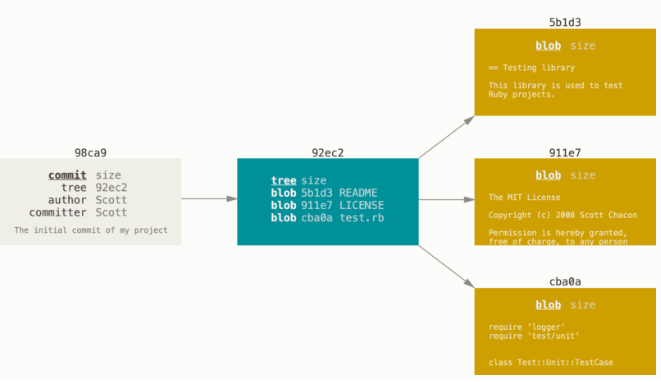

Якщо ви зробите якісь зміни та зафіксуєте знову, наступна фіксація буде зберігати вказівник на попередню.

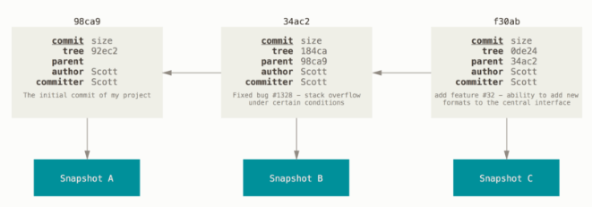

Гілка в Git це просто легкий вказівник, що може пересуватись, на одну з цих фіксацій. Загальноприйнятим 
ім’ям першої гілки в Git є `master`. Коли ви почнете робити фіксації, вам надається гілка `master`, 
що вказує на останню зроблену фіксацію. Щоразу ви фіксуєте, вона переміщується вперед автоматично.

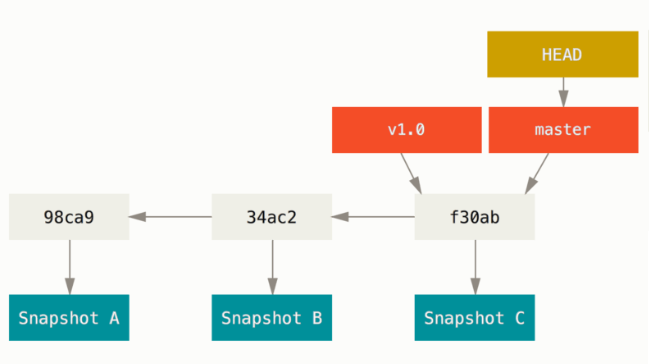

### Створення нової гілки

Що відбувається, якщо ви створюєте нову гілку? Ну, це створює новий вказівник, щоб ви могли пересуватися. 
Припустімо, ви створюєте нову гілку під назвою `testing`. Ви це робите за допомогою команди `git branch`:

`$ git branch testing`

Це створює новий вказівник на фіксацію, в якій ви зараз знаходитесь.

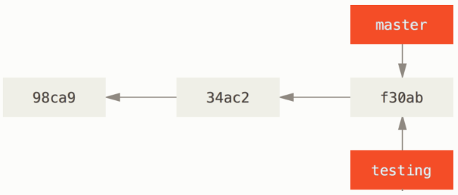

Звідки Git знає, на якій гілці ви зараз знаходитесь? Він зберігає особливий вказівник під назвою `HEAD`.
У Git це вказівник на локальну гілку, на якій ви знаходитесь. В даному випадку, ви досі на гілці 
`master`. Команда `git branch` тільки створює нову гілку — вона не переключає на цю гілку.

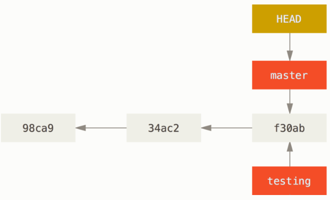

Ви легко можете це побачити за допомогою простої опції команди git log, що може показати куди вказують 
вказівники гілок. Ця опція називається `--decorate`, також використаємо `--oneline` для короткого 
відображення:

```
$ git log --oneline --decorate
f30ab (HEAD -> master, testing) add feature #32 - ability to add new formats to the central interface
34ac2 Fixed bug #1328 - stack overflow under certain conditions
98ca9 The initial commit of my project
```
Як бачите, гілки `master` та `testing` прямо поруч з фіксацією `f30ab`.

### Переключення гілок

Щоб переключитися на існуючу гілку, треба виконати команду `git checkout`. Переключімося на нову 
гілку `testing`:

`$ git checkout testing`

Це пересуває `HEAD`, щоб він вказував на гілку `testing`.

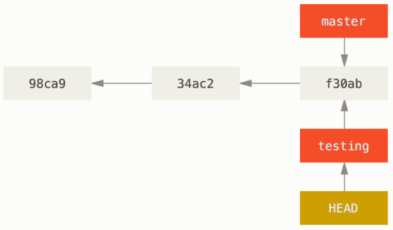

Давайте зробимо ще одну фіксацію:

`$ git commit -am "Зробив зміни"`

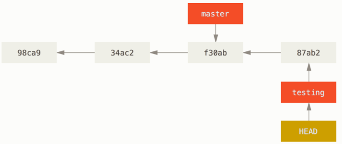

Це цікаво, бо тепер ваша гілка `testing` пересунулась уперед, а ваша гілка `master` досі вказує 
на фіксацію, що й у момент виконання git checkout для переключення гілок. Повернімося назад 
до гілки `master`:

`$ git checkout master`

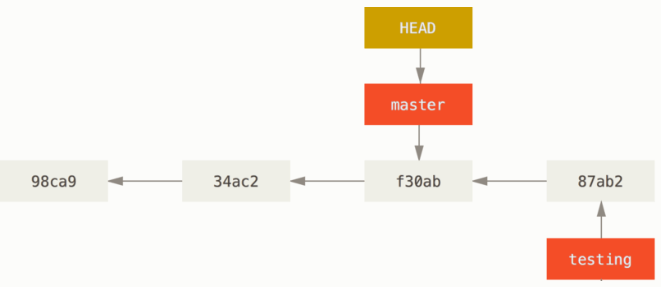

Ця команда зробила дві речі. Вона пересунула вказівник `HEAD` назад на гілку `master`, та повернула файли 
у вашій робочій теці до стану знімку, на який вказує `master`. Це також означає, що якщо ви зараз зробите 
нові зміни, вони будуть походити від ранішої версії проекту.

Зробимо декілька змін та знову зафіксуємо:

`$ git commit -am "Зробив інші зміни"`

Тепер історія вашого проекту розбіглася (`diverged`) (дивіться Історія, що розбіглася). Ви створили 
гілку, дещо в ній зробили, переключились на головну гілку та зробили там щось інше. Обидві зміни 
ізольовані в окремих гілках. Ви можете переключатись між цими гілками та злити їх, коли вони будуть 
готові. І все це ви зробили за допомогою простих команд `branch`, `checkout` та `commit`.

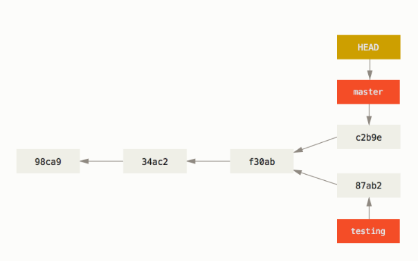

Ви також можете легко це побачити за допомогою команди `git log`. Якщо ви виконаєте 
`git log --oneline --decorate --graph --all`, вона надрукує історію ваших фіксацій, 
покаже куди вказують ваші гілки та як розбіглася ваша історія.
```
$ git log --oneline --decorate --graph --all
* c2b9e (HEAD, master) Зробив інші зміни
| * 87ab2 (testing) Зробив зміни
|/
* f30ab add feature #32 - ability to add new formats to the
* 34ac2 fixed bug #1328 - stack overflow under certain conditions
* 98ca9 initial commit of my project
```

Оскільки гілка в Git — це насправді простий файл, що містить 50 символів контрольної суми SHA-1 
коміту, на який вказує, гілки дешево створювати та знищувати.

### Основи галуження

Скажімо, ви працюєте над проектом і вже маєте кілька комітів у гілці master.

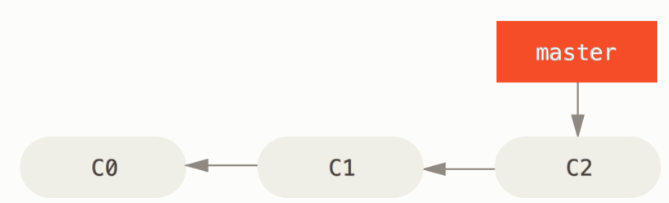

Тепер вирішили працювати над задачею, котра в системі вашої компанії зареєстрована як №53. 
Щоб створити нову гілку для цієї задачі та одразу перейти на неї, виконайте команду `git checkout` 
з параметром `-b`:
```
$ git checkout -b iss53
Switched to a new branch "iss53"
```

Це скорочений запис наступного:
```
$ git branch iss53
$ git checkout iss53
```
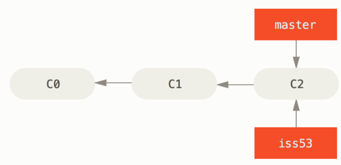

Ви працюєте над змінами до сайту та комітите зміни. Таким чином ваша гілка `iss53` починає 
рухається вперед, оскільки ви на неї раніше переключилися (тобто вказівник `HEAD` вказує на цю гілку):

`$ git commit -a -m 'added a new footer [issue 53]'`

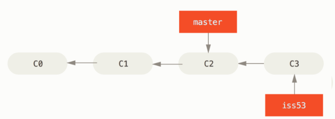

Вам подзвонили та доповіли про проблему на сайті, якої потрібно якнайшвидше позбутися. 
Завдяки Git, вам не потрібно відсилати це виправлення разом із змінами в `iss53`, також, 
ви не докладете багато зусиль для того щоб скасувати поточні зміни та працювати над 
виправленням в основній гілці. Все що потрібно, це знову переключитися на основну гілку `master`.

Проте, зверніть увагу на те, що якщо у вашій робочій директорії чи області з підготовленими 
файлами є незакомічені зміни, це спричинить конфлікт з гілкою `master` та Git не дозволить зробити 
це переключення. Найкраще спочатку очистити вашу робочу область перед переключеннями або закомітити 
поточні зміни у вітці
```
$ git checkout master
Switched to branch 'master'
```

Тепер ваша робоча директорія точно в такому стані, як була до того, як ви почали працювати 
над №53 і ви можете сфокусуватися на терміновому виправленні. Важливо запам’ятати: коли перемикаєтеся 
між гілками, Git відновлює вашу робочу директорію, щоб вона виглядала так як після вашого останнього 
коміту. Git додає, видаляє та змінює файли автоматично, щоб впевнитися що ваша робоча копія точно 
відповідає тому якою була гілка на час вашого останнього коміту.

Далі вам знову потрібно зробити ще одне швидке виправлення. Створимо гілку `hotfix` і будемо там 
працювати поки не закінчимо:

```
$ git checkout -b hotfix
Switched to a new branch 'hotfix'
$ vim index.html
$ git commit -a -m 'fixed the broken email address'
[hotfix 1fb7853] fixed the broken email address
 1 file changed, 2 insertions(+)
```

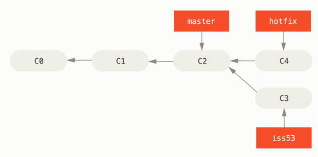

Тепер можете запускати тести, щоб впевнитися що зміна годиться і нарешті злити (`merge`) гілку 
`hotfix` назад до `master` щоб викласти зміни на виробництво. Робиться це за допомогою команди 
`git merge` command:
```
$ git checkout master
$ git merge hotfix
Updating f42c576..3a0874c
Fast-forward
 index.html | 2 ++
 1 file changed, 2 insertions(+)
```
Зверніть увагу на фразу “fast-forward” у цьому злитті. Через те, що коміт `C4`, який зливався, 
належав гілці `hotfix`, що була безпосередньо попереду поточного коміту `C2`, Git просто переміщує 
вказівник вперед. Іншими словами, коли ви зливаєте один коміт з іншим, і це можна досягнути 
слідуючи історії першого коміту, Git просто переставляє вказівник, оскільки немає змін-відмінностей, 
які потрібно зливати разом - це називається “перемоткою” (“fast-forward”).

Тепер ваша зміна міститься в знімку коміту, на який вказує master і ви можете викладати зміни.

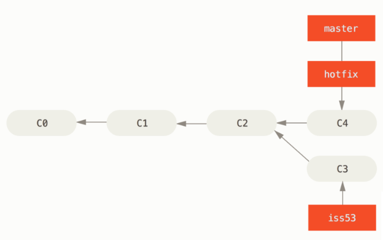

Після того, як ваше супер важливе виправлення викладено, можна повернутися до роботи, яку було 
відкладено через швидке виправлення. Але спочатку видалимо гілку `hotfix` — нам вона більше не потрібна, 
а `master` вказує на той самий знімок коду. Для цього виконайте `git branch` з опцією `-d`:
```
$ git branch -d hotfix
Deleted branch hotfix (3a0874c).
```

Тепер перемикайтеся на вашу незакінчену гілку для №53 і продовжуйте роботу.
```
$ git checkout iss53
Switched to branch "iss53"
$ vim index.html
$ git commit -a -m 'finished the new footer [issue 53]'
[iss53 ad82d7a] finished the new footer [issue 53]
1 file changed, 1 insertion(+)
```
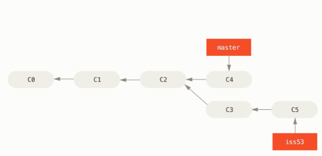

### Основи зливання

Допустимо, ви вирішили, що робота над №53 завершена і готова до злиття з гілкою `master`. 
Для цього ви виконаєте злиття гілки `iss53` до `master` саме так, як раніше робили це з гілкою `hotfix`. 
Все що потрібно це перемкнутися на вашу робочу гілку і виконати команду `git merge`:

```
$ git checkout master
Switched to branch 'master'
$ git merge iss53
Merge made by the 'recursive' strategy.
index.html |    1 +
1 file changed, 1 insertion(+)
```

Виглядає трошки інакше, ніж те, що ми робили з гілкою `hotfix`. У цьому випадку історія змін двох 
гілок почала відрізнятися в якийсь момент. Оскільки коміт поточної гілки не є прямим нащадком гілки, 
в яку ви зливаєте зміни, Git мусить трохи попрацювати. В цьому випадку Git робить просте триточкове 
злиття, користуючись двома знімками, що вказують на гілки та третім знімком - їх спільним предком.

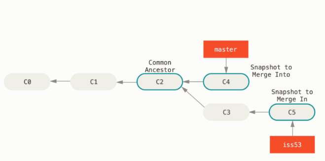

Замість того, щоб просто пересунути вказівник гілки вперед, Git створює новий знімок, що є результатом 
3-точкового злиття, і автоматично створює новий коміт, що вказує на нього. Його називають комітом злиття 
(merge commit) та його особливістю є те, що він має більше одного батьківського коміту.


Варто зауважити, що Git сам визначає найбільш підходящого спільного нащадка, якого брати за основу зливання.

Тепер, коли ваші зміни злиті, гілка `iss53 вам` більше не потрібна. Можете закривати задачу №53 та 
видаляти гілку:

`$ git branch -d iss53`

### Основи конфліктів зливання

Трапляється, що цей процес не проходить гладко. Якщо ви маєте зміни в одному й тому самому місці в 
двох різних гілках, Git не зможе їх просто злити. Якщо підчас роботи над №53 ви поміняли ту саму 
частину файлу, що й у гілці hotfix, ви отримаєте конфлікт, що виглядає приблизно так:

```
$ git merge iss53
Auto-merging index.html
CONFLICT (content): Merge conflict in index.html
Automatic merge failed; fix conflicts and then commit the result.
```
У цьому випадку Git не створив автоматичний коміт зливання. Він призупинив процес допоки ви не 
вирішите конфлікт. Для того, щоб переглянути знову які саме файли спричинили конфлікт, виконайте 
`git status`:
```
$ git status
On branch master
You have unmerged paths.
  (fix conflicts and run "git commit")

Unmerged paths:
  (use "git add <file>..." to mark resolution)

    both modified:      index.html

no changes added to commit (use "git add" and/or "git commit -a")
```

Все, що має конфлікти, які не були вирішені є в списку незлитих (`unmerged`) файлів. У кожен такий файл 
Git додає стандартні позначки-вирішенння для конфліктів, отже ви можете відкрити ці файли і вирішити 
конфлікти самостійно. У вашому файлі з конфліктом з'явиться блок, схожий на такий:
```
<<<<<<< HEAD:index.html
<div id="footer">contact : email.support@github.com</div>
=======
<div id="footer">
 please contact us at support@github.com
</div>
>>>>>>> iss53:index.html
```
Розглянемо, як це розуміти. Версія файлу в `HEAD` (з вашої `master` гілки, оскільки ви запустили зливання, 
будучи на ній) у верхній частині блоку (все вище `=======`), а версія з `iss53` - все, що нижче. 
Щоб розв’язати цю несумісність, вам потрібно вибрати одну із версій, або самостійно (вручну) 
поредагувати вміст файлу. Наприклад, ви можете вирішити цей конфілікт, замінивши блок повністю:
```
<div id="footer">
please contact us at email.support@github.com
</div>
```

В цьому випадку ми взяли потрохи з кожної секції, а стрічки `<<<<<<<`, `=======` та `>>>>>>>` видалили 
повністю. Після того, як ви розв’язали подібні несумісності в кожному блоці конфліктних файлів, виконайте 
для них `git add`, щоб індексувати та позначити, як розв’язані. Індексуючи файл, ви позначаєте його для Git 
таким, що більше не має конфлікту. 

Тепер, коли ви вже вмієте створювати гілки, зливати їх та видаляти, розгляньмо те, як ними управляти, та 
на інструменти, які можуть в цьому допомогти.

Команда `git branch` насправді вміє більше ніж просто створювати та знищувати гілки. Запустіть її без 
параметрів і ви побачите просто список ваших гілок:

```
$ git branch
  iss53
* master
  testing
```

Зверніть увагу на символ `*` перед `master`: це вказівник на вашу поточно вибрану гілку (тобто ту, 
на котру вказує `HEAD`). Це означає, що якщо ви зараз захочете зробити коміт, `master` оновиться вашими 
новими змінами. Щоб побачити ваші останні коміти - запустіть `git branch -v`:

```
$ git branch -v
  iss53   93b412c fix javascript issue
* master  7a98805 Merge branch 'iss53'
  testing 782fd34 add scott to the author list in the readmes
```

Опції `--merged` та `--no-merged` корисні для фільтрування списку гілок залежно від того чи вони були злиті 
з поточною гілкою. Для списку гілок, що були злиті з поточною гілкою виконайте `git branch --merged`:
```
$ git branch --merged
  iss53
* master
```

Ви бачите `iss53` в цьому списку тому, що раніше її злили з `master`. Взагалі, гілки без `*` із цього списку 
можна вже видаляти (за допомогою `git branch -d`), адже ми вже інтегрували ті зміни, тому не втратимо їх.

Команда `git branch --no-merged` покаже гілки, які ви не зливали з поточною гілкою:
```
$ git branch --no-merged
  testing
```

Тут ви бачите свою іншу гілку. Оскільки дана гілка містить роботу, що не зливалася, спроба видалити
її за допомогою `git branch -d` не буде успішною:

```
$ git branch -d testing
error: The branch 'testing' is not fully merged.
If you are sure you want to delete it, run 'git branch -D testing'.
```

Якщо ж ви дійсно впевнені в тому, що гілка вам не потрібна і всі зміни з неї можна втрачати, можна 
змусити Git це зробити за допомогою параметра `-D`. Про що Git вам і повідомляв з попередньої спроби.

## Підсумок

Ми з вами побачили і використали основні інструменти взаємодії з Git. Сподідавємось, цо це неодмінно стане
у нагоді під час створення власного репозиторію та у керуванні архітектурою вашого проекту. Тепер ви знайомі
з чудовим інструментом - системою контролю версій Git, успіхів у розробці.

### Матеріал підготували студенти групи ІВ-81:
* Зікратий Дмитро - [shooterdimon](https://github.com/shooterdimon)
* Тріщук Денис - [krissayrose](https://github.com/krissayrose)
