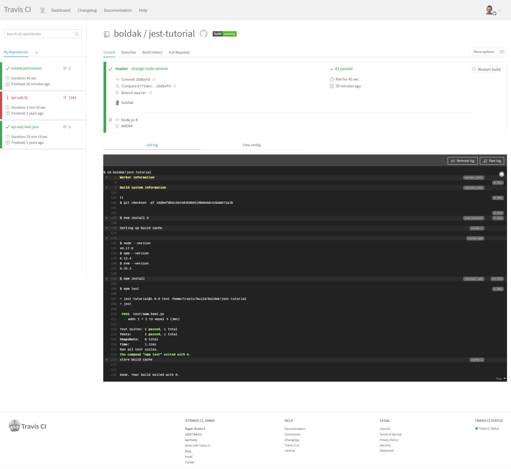

# Тестування програмного забезпечення
Тестування – це процес перевірки, дослідження програмного продукту, який має за ціль перевірку відповідностей між реальною поведінкою програми та її очікуваною поведінкою на кінцевому наборі тестів, обраних відповідним шляхом.
Також тестування пояснюється у різних джерелах як:

* Процес виконання програми з ціллю пошуку помилок
* Інтелектуальна дисципліна, яка має за ціль отримання програмного забезпечення без надмірних затрат на його перевірку
* Технічне дослідження програми для отримання інформації про її якість з точки зору певного кола зацікавлених осіб
* Процес нагляду за виконання програми у спеціальних умовах та отримання оцінки  будь-яких аспектів її роботи
* Процес, який має за ціль вияв ситуацій, в яких поведінка програми є неправильною, або не відповідає специфікації
* Процес, який має у собі усі активності життєвого циклу, як динамічні, так і статичні, які мають відношення до планування, підготовки та оцінки програмного продукту та зв’язаних з цим результатів роботи з ціллю визначити, що вони підходять для заявлених цілей та для визначення дефектів

## Рівні тестування
    
* Тестування компонентів – тестується мінімально можливий для тестування компонент, наприклад, окремий клас або функція. Часто тестування компонентів виконується розробниками програмного забезпечення
* Інтеграційне тестування – тестуються інтерфейси між компонентами, підсистемами, системами. При наявності резерва часу на даній стадії тестування ведеться ітераційно, з послідовним підключенням послідуючих пілсистем
* Системне тестування – тестується інтегрована система на її відповідність вимогам
* Альфа-тестування – імітація реальної роботи з системою штатними розробниками, або реальна робота з системою потенціальними користувачами. Частіше за все альфа-тестування проводиться на ранній стадії розробки продукту, але у деяких випадках може використовуватися для завершенго продукту у якості внутрішнього тестування. Іноді альфа-тестування виконується під відладчиком або з використанням оточення, яке допомагає швидко виявити знайдені помилки. Знайдені помилки можуть бути передані тестувальникам для додаткового дослідження в оточенні, подібному до того, у якому буде використовуватися програма.
* Бета-тестування – у деяких випадках виконується розповсюдження тестової версії(у випадку програмного забезпечення з обмеженнями функціональності або часу роботи) для деякої великої групи осіб, щоб впевнетися, що продукт має достатньо мало помилок. Іноді бета-тестування виконується для того, щоб отримати зворотній зв’язок від майбутніх користувачів про продукт 
* Операційне тестування – навіть якщо система задовольняє всім вимогам, важливо переконатися, що вона задовольняє всім вимогам користувача та виконує свою роль у оточенні своєї експлуатації, як це було визначено у бізнес-моделі системи. Важливо, що бізнес-модель також може мати помилки. Тому так важливо провести правильне операційне тестування, як фінальний крок валідації. Крім того, тестування у оточенні експлуатації дозволяє виявити нефункціональні проблеми, такі як: конфлікт з іншими системами, недостатня продуктивність системи в оточенні експлуатації. Очевидно, що знаходження таких речей на стадії інтеграції – дуже дорога та критична проблема. Тому важливо проведення не тільки верифікації, але і валідації з самих ранніх етапів розробки програмного забезпечення
* Приймальне тестування – формальний процес тестування, який перевіряє відповідність системи вимогам та проводиться з ціллю: визначення вдовольняє система приймальні критерії, чи ні, винесення рішення замовником або іншою вповноваженою особою приймається програмний продукт, чи ні.
 
## Види та типи тестування

Функціональні види тестування

* Функціональне тестування (Functional testing) – розглядає раніше вказану поведінку та має за основу аналіз специйікації функціональності компонента або системи загалом;
* Тестування безпеки (Security and Access Control Testing) – стратегія тестування, яка використовується для перевірки безпеки системи, а також для аналізу ризиків, зв’язаних з забезпеченням цілісного підходу до захисту додатку, атак хакерів, вірусів, несанкціонованого доступу до конфіденціальних даних;
* Тестування взаємодії (Interoperability Testing) – функціональне тестування, яке перевіряє можливість додатку взаємодіяти з одним або більше компонентами або системами та тестування сумісності та інтеграційне тестування;

Нефункціональні види тестування
Тестування продуктивності:

* Тестування навантаження(Performance and Load Testing) – автоматизоване тестування, яке імітує роботу певної кількості бізнес-користувачів на якомусь загальному ресурсі;
* Стресове тестування(Stress Testing) – дозволяє перевірити наскільки додаток та система в цілому працездатні в умовах стресу, атакож оцінити можливість системи до регенерації, тобто до повернення до нормального стану після закінчення впливу стресу. Стресом у даному випадку може бути підвищення інтенсивності виконання операцій до дуже високих значень або аварійна зміна конфігурація сервера. Також однією з задач при стресовому тестування може бути оцінка деградації продуктивності. Таким чином цілі стресового  тестування можуть пересікатися з цілями тестування продуктивності;
* Тестування стабільності та надійності(Stability / Reliability Testing) – задачею тестування стабільності є перевірка працездатності додатку при довготривалому тестуванні з середнім рівнем навантаження;
* Об’ємне тестування(Volume Testing) – задачею об’ємного тестування є отримання оцінки продуктивності при збільшенні об’ємів даних у базі даних додатку;
* Тестування установки(Installation testing) – направлено на перевірку успішної інсталяції та настройки, а також оновлення та видалення програмного забезпечення;
* Тестування зручності користування(Usability Testing) – це метод тестування, спрямований на встановлення ступеня зручності використання, навченості, зрозумілості і привабливості для користувачів продукту, що розробляється в контексті заданих умов. Тестування для користувача інтерфейсу (англ. UI Testing) - це вид тестування дослідження, виконуваного з метою визначення, чи зручний деякий штучний об'єкт (такий як веб-сторінка, призначений для користувача інтерфейс або пристрій) для його передбачуваного застосування. User eXperience (UX) - відчуття, яке відчувається користувачем під час використання цифрового продукту, в той час як User interface - це інструмент, що дозволяє здійснювати интеракцию «користувач - веб-ресурс»;
* Тестування на відмову та відновлення(Failover and Recovery Testing) - перевіряє тестований продукт з точки зору здатності протистояти і успішно відновлюватися після можливих збоїв, що виникли в зв'язку з помилками програмного забезпечення, відмовами обладнання або проблемами зв'язку (наприклад, відмова мережі). Метою даного виду тестування є перевірка систем відновлення (або дублюючих основний функціонал систем), які, в разі виникнення збоїв, забезпечать збереження і цілісність даних тестованого продукту;
* Конфігураційне тестування(Configuration Testing) - спеціальний вид тестування, спрямований на перевірку роботи програмного забезпечення при різних конфігураціях системи (заявлених платформах, підтримуваних драйвери, при різних конфігураціях комп'ютерів і т.д.);

Зв’язані зі змінами види тестування
    
* Димове тестування(Smoke Testing) - тестування розглядається як короткий цикл тестів, що виконується для підтвердження того, що після складання коду (нового або відредагованого) встановлюється додаток, стартує і виконує основні функції;
* Регресивне тестування(Regression Testing) - це вид тестування спрямований на перевірку змін, зроблених в додатку або навколишньому середовищу (лагодження дефекту, злиття коду, міграція на іншу операційну систему, базу даних, веб сервер або сервер додатки), для підтвердження того факту, що існуюча раніше функціональність працює як і раніше . Регресійний можуть бути як функціональні, так і нефункціональні тести;
* Повторне тестування(Re-testing) - тестування, під час якого виконуються тестові сценарії, які виявили помилки під час останнього запуску, для підтвердження успішності виправлення цих помилок. У чому різниця між regression testing і re-testing? Re-testing - перевіряється виправлення «багів». Regression testing - перевіряється те, що виправлення «багів» не вплинуло на інші модулі ПО і не викликало нових «багів»;
* Тестування збірки(Build Verification Test) - тестування спрямоване на визначення відповідності, випущеної версії, критеріям якості для початку тестування. За своїми цілями є аналогом димового тестування, спрямованого на приймання нової версії в подальше тестування або експлуатацію. Вглиб воно може проникати далі, в залежності від вимог до якості випущеної версії;
* Санітарне тестування або перевірка справності(Sanity Testing) - це вузьконаправлене тестування достатню для доказу того, що конкретна функція працює згідно із заявленими в специфікації вимогам. Є підмножиною регресійного тестування. Використовується для визначення працездатності певної частини програми після змін вироблених в ній або навколишньому середовищу. Зазвичай виконується вручну;

## Принципи тестування
**Тестування демонструє наявність дефектів (Testing shows presence of defects)**
Тестування може показати, що дефекти присутні, але не може довести, що їх немає. Тестування знижує ймовірність наявності дефектів, що знаходяться в програмному забезпеченні, але, навіть якщо дефекти не були виявлені, це не доводить його коректності.

**Повне тестування недосяжно (Exhaustive testing is impossible)**
Повне тестування з використанням всіх комбінацій вводів і передумов фізично неможливо, за винятком тривіальних випадків. Замість вичерпного тестування повинні використовуватися аналіз ризиків і розстановка пріоритетів, щоб більш точно сфокусувати зусилля по тестуванню.

**Раннє тестування (Early testing)**
Щоб знайти дефекти якомога раніше, активності по тестуванню повинні бути розпочаті якомога раніше в життєвому циклі розробки програмного забезпечення або системи, і повинні бути сфокусовані на певних цілях.

**Скупчення дефектів (Defects clustering)**
Зусилля тестування повинні бути зосереджені пропорційно очікуваній, а пізніше реальної щільності дефектів по модулях. Як правило, більша частина дефектів, виявлених при тестуванні або спричинили за собою основну кількість збоїв системи, міститься в невеликій кількості модулів.

**Парадокс пестициду (Pesticide paradox)**
Якщо одні й ті ж тести будуть проганяти багато разів, в кінцевому рахунку цей набір тестових сценаріїв більше не буде знаходити нових дефектів. Щоб подолати цей «парадокс пестициду», тестові сценарії повинні регулярно рецензуватися і коригуватися, нові тести повинні бути різнобічними, щоб охопити всі компоненти програмного забезпечення, або системи, і знайти якомога більше дефектів.

**Тестування залежить від контексту (Testing is concept depending)**
Тестування виконується по-різному в залежності від контексту. Наприклад, програмне забезпечення, в якому критично важлива безпека, тестується інакше, ніж сайт електронної комерції.

**Помилка про відсутність помилок (Absence-of-errors fallacy)**
Виявлення і виправлення дефектів не допоможуть, якщо створена система не підходить користувачеві і не задовольняє його очікуванням і потребам.

# Платформа для тестування «Jest»
[Jest](https://jestjs.io/) використовується для перевірки всіх кодів JavaScript, включаючи React applications. 
Одна з філософії Jest полягає в тому, щоб забезпечити комплексний досвід "нульової конфігурації". 
Розробники помітили, що коли інженери отримують готові до використання інструменти, вони закінчуються написанням додаткових 
тестів, що, у свою чергу, призводить до більш стабільних та здорових кодів.

Jest розпаралелює тестові «рани» між робочими, щоб максимізувати продуктивність. Консольні повідомлення буферизуються та 
друкуються разом з результатами тесту. Пісочні тестові файли та автоматичні глобальні стани скидуються для кожного тесту, 
тому два тести не конфліктують один з одним.

**Вбудовані звіти про покриття коду**
Легко створювати звіти про покриття коду з допомогою – coverage. Ніяких додаткових налаштувань та бібліотек не потрібно. 
Jest може збирати інформацію про покриття коду з цілих проектів, включаючи неперевірені файли.

**Нульова конфігурація**
Jest вже налаштований, коли ви використовуєте ваш додаток `create-react-app` або `action-init` для створення ваших проектів 
React и React Native. Помістіть свої тести у папку `__tests__` або назвіть тестові файли з розширенням `.spec.js` або 
`.test.js`.

### Початок роботи
Розглянемо встановлення Jest на комп’ютер та базові навички створення тестів.
Для того, щоб встановити Jest на комп’ютер, потрібно мати встановлений npm. Після цого відкриваємо командний рядок та прописуємо такий рядок:
```
npm install –-save-dev jest
```
Створюємо файл з розширенням `.js`. На прикладі розглянемо файл `sum.js` з відповідним текстом всередині:
```js
    module.exports = (a, b) => a + b
```
Далі створюємо файл з тестом `sum.test.js`:
 
```js
    const sum = require("./sum")
    
    test('adds 1 + 2 to equal 3', () => {
        expect( sum(1, 2)).toBe(3)
    })
```
Створюємо файл `package.json`:
```json
    {
      "name": "jest-tutorial",
      "version": "1.0.0",
      "main": "index.js",
      "scripts": {
        "test": "jest"
      },
      "author": "",
      "dependencies": {},
      "devDependencies": {
        "jest": "^25.0.1"
      }
    }

```
Для того, щоб запустити тестовий файл, відкриваємо командний рядок та виконуємо команду:
```
npm test
```
Бачимо результат проходження тесту у командному рядку:
```
    > jest-tutorial@1.0.0 test D:\docs\EDU\Software Ingeneering\jest-tutorial                                                         
    > jest                                                                                                                            
                                                                                                                                  
    PASS  test/sum.test.js                                                                                                           
        √ adds 1 + 2 to equal 3 (3ms)                                                                                                   
                                                                                                                                  
        Test Suites: 1 passed, 1 total                                                                                                    
    Tests:       1 passed, 1 total                                                                                                    
    Snapshots:   0 total                                                                                                              
    Time:        2.088s                                                                                                               
    Ran all test suites.  
```
 

### Об’єкт Globals
У файлах з тестами Jest імпортує  методи та об’єкти в глобальне середовище.

`afterAll(fn, timeout)`
Виконує функцію після виконання всіх тестів. Якщо функція повертає promise, тоді  Jest його очікує перед продовженням. Можна задати час очікування (за замовченням 5 сек.) переривання виконання функції

```js
    const globalDatabase = makeGlobalDatabase();

    function cleanUpDatabase(db) { 
        db.cleanUp(); 
    }

    afterAll(() => { 
        cleanUpDatabase(globalDatabase); 
    });

    test('can find things', () => { 
        return globalDatabase.find('thing', {}, results => { 
            expect(results.length).toBeGreaterThan(0); 
        }); 
    });
    
    test('can insert a thing', () => { 
        return globalDatabase.insert('thing', makeThing(), response => {
            expect(response.success).toBeTruthy(); 
        }); 
    });
```

`afterEach(fn, timeout)` виконує функцію після виконання кожного теста.
```js 
    const globalDatabase = makeGlobalDatabase();

    function cleanUpDatabase(db) { 
        db.cleanUp(); 
    }

    afterEach(() => { 
        cleanUpDatabase(globalDatabase); 
    });

    test('can find things', () => { 
        return globalDatabase.find('thing', {}, results => { 
            expect(results.length).toBeGreaterThan(0); 
        }); 
    });

    test('can insert a thing', () => { 
        return globalDatabase.insert('thing', makeThing(), response => {
            expect(response.success).toBeTruthy(); 
        }); 
    });
```

`beforeAll(fn, timeout)` Виконує фунцію перед виконанням тестів.
```js
    const globalDatabase = makeGlobalDatabase();

    beforeAll(() => { 

    // Clears the database and adds some testing data. 
    // Jest will wait for this promise to resolve before running tests. 
    
        return globalDatabase.clear().then(() => { 
            return globalDatabase.insert({testData: 'foo'}); 
        }); 
    });

    // Since we only set up the database once in this example, it's important 
    // that our tests don't modify it. 

    test('can find things', () => { 
        return globalDatabase.find('thing', {}, results => { 
            expect(results.length).toBeGreaterThan(0); 
        }); 
    });
```

`beforeEach(fn, timeout)` Виконує функцію перед виконанням кожного теста.
```js
    const globalDatabase = makeGlobalDatabase();

    beforeEach(() => { 

    // Clears the database and adds some testing data. 
    // Jest will wait for this promise to resolve before running tests. 
        return globalDatabase.clear().then(() => { 
            return globalDatabase.insert({testData: 'foo'}); 
        }); 
    });

    test('can find things', () => { 
        return globalDatabase.find('thing', {}, results => { 
            expect(results.length).toBeGreaterThan(0); 
        }); 
    });
    
    test('can insert a thing', () => { 
        return globalDatabase.insert('thing', makeThing(), response => {
            expect(response.success).toBeTruthy(); 
        }); 
    }); 
```
`describe(name, fn)` Створює блок, який групує декілька тестів.
```js
    const myBeverage = { delicious: true, sour: false};
    describe('my beverage', () => { 
        test('is delicious', () => { 
            expect(myBeverage.delicious).toBeTruthy(); 
        });
        test('is not sour', () => { 
            expect(myBeverage.sour).toBeFalsy(); 
        }); 
    });
```

Можна використовувати вкладені блоки.
```js
    const binaryStringToNumber = binString => { 
    if (!/^[01]+$/.test(binString)) { 
        throw new CustomError('Not a binary number.'); 
    }
    return parseInt(binString, 2); 
    };
    
    describe('binaryStringToNumber', () => { 
    
        describe('given an invalid binary string', () => { 
            test('composed of non-numbers throws CustomError', () => { 
                expect(() => binaryStringToNumber('abc')).toThrowError(CustomError); 
            });
            test('with extra whitespace throws CustomError', () => {
                expect(() => binaryStringToNumber('  100')).toThrowError(CustomError);
            });
        });
    
        describe('given a valid binary string', () => { 
            test('returns the correct number', () => { 
                expect(binaryStringToNumber('100')).toBe(4); 
            }); 
        }); 
    }); 
```
`describe.only(name, fn)` Використовується, коли треба виконати лише один блок.
```js    
    describe.only('my beverage', () => { 
        test('is delicious', () => { 
            expect(myBeverage.delicious).toBeTruthy(); 
        });
        test('is not sour', () => { 
            expect(myBeverage.sour).toBeFalsy(); 
        }); 
    });
    
    describe('my other beverage', () => { 
    // ... will be skipped 
    }); 
```
`describe.skip(name, fn)` Визначає блок, який треба пропустити.
```js
    describe('my beverage', () => { 
        test('is delicious', () => { 
            expect(myBeverage.delicious).toBeTruthy(); 
        });
        test('is not sour', () => { 
            expect(myBeverage.sour).toBeFalsy(); 
        }); 
    });
    
    describe.skip('my other beverage', () => { 
    // ... will be skipped 
    });
```

### Об’єкт Expect
Під час написання тестів необхідно перевіряти різноманітні умови з значеннями. Об’єкт `expect`  надає доступ до множини 
перевірок, які можна для цього використовувати.

`expect(value)` Використовується для перевірки значення разом з іншими перевірками.
```js 
    test('the best flavor is grapefruit', () => { 
        expect(bestLaCroixFlavor()).toBe('grapefruit'); 
    });
```    
Де `toBe` є перевіркою. Аргумент функції `expect` повинен бути значенням, що генерується вашим кодом, та будь-які аргументи 
перевірок повинні бути коректними значеннями.

`expect.extend(matchers)` Можна використовувати `expect.extend`  для доданання власних перевірок:
```js
    expect.extend({
        toBeDivisibleBy(received, argument) { 
            const pass = received % argument == 0; 
                if(pass){ 
                return { 
                    message: () => `expected ${received} not to be divisible by ${argument}`, 
                    pass: true 
                }
            }else{ 
                return { 
                    message: () => `expected ${received} to be divisible by ${argument}`, 
                    pass: false
                } 
            } 
        } 
    });
    
    test('even and odd numbers', () => { 
        expect(100).toBeDivisibleBy(2); 
        expect(101).not.toBeDivisibleBy(2); 
    }); 
```
Перевірка повинна повертати об’єкт з двома полями: `pass` показує, чи успішно пройшла перевірка,  `message` надає функцію без 
аргументів, яка повертає повідомлення про помилку в разі неуспішності перевірки. Та коли `pass` має значення `true`, `message` 
повинна повертати повідомлення про помилку для `expect(x).not.yourMatcher()`.

`expect.anything()` успішна при будь-якому значенні окрім `null` або `undefined`. 
Можна використовувати в середені `toEqual` або `toBeCalledWith` навколо літеральних значень. 
Наприклад, для перевірки виклику mock-функції з непустим аргументом:
```js
    test('map calls its argument with a non-null argument', () => { 
        const mock = jest.fn(); 
        [1].map(x => mock(x)); 
        expect(mock).toBeCalledWith(expect.anything()); 
    });
```
`expect.any(constructor)` успішна для будь-якого значення, створеного конструктором `constructor`. 
Можна використовувати в середені `toEqual` або `toBeCalledWith` навколо літеральних значень. 
Наприклад, для перевірки виклику mock-функції з числовим аргументом:
```js
    function randocall(fn) { 
        return fn(Math.floor(Math.random() * 6 + 1)); 
    }
    
    test('randocall calls its callback with a number', () => { 
        const mock = jest.fn(); 
        randocall(mock); 
        expect(mock).toBeCalledWith(expect.any(Number)); 
    }); 
```

`expect.arrayContaining(array)` успішна, якщо прийнятий масив містить всі елементи очікуваного масиву array. 
```js
    describe('arrayContaining', () => { 
        const expected = ['Alice', 'Bob']; 
        it('matches even if received contains additional elements', () => { 
            expect(['Alice', 'Bob', 'Eve']).toEqual(expect.arrayContaining(expected)); 
        }); 
        it('does not match if received does not contain expected elements', () => { 
            expect(['Bob', 'Eve']).not.toEqual(expect.arrayContaining(expected)); 
        }); 
    });
    
    describe('Beware of a misunderstanding! A sequence of dice rolls', () => { 
        const expected = [1, 2, 3, 4, 5, 6]; 
        it('matches even with an unexpected number 7', () => { 
            expect([4, 1, 6, 7, 3, 5, 2, 5, 4, 6]).toEqual( expect.arrayContaining(expected)); 
        }); 
        it('does not match without an expected number 2', () => { 
            expect([4, 1, 6, 7, 3, 5, 7, 5, 4, 6]).not.toEqual(expect.arrayContaining(expected)); 
        }); 
    });
```
`expect.assertions(number)` перевіряє кількість перевірок, викликаних протягом тесту. 
Наприклад, маємо функцію `doAsync` яка приймає дві функції зворотного виклику `callback1` та `callback2`, вони будуть викликані 
асинхронно у невідомому порядку:
```js
    test('doAsync calls both callbacks', () => { 
        expect.assertions(2); 
        
        function callback1(data) { 
            expect(data).toBeTruthy(); 
        } 
        
        function callback2(data) { 
            expect(data).toBeTruthy(); 
        }
        
        doAsync(callback1, callback2); 
    }); 
```
`expect.assertions(2)` перевіряє кількість викликаних колбеків.


`expect.hasAssertions()` перевіряє, що хоча б один раз буде викликаниа перевірка. 
```js
    test('prepareState prepares a valid state', () => { 
        expect.hasAssertions(); 
        prepareState(state => { 
            expect(validateState(state)).toBeTruthy(); 
        }); 
        return waitOnState(); 
    });
```
`expect.hasAssertions()` перевіряє, що `prepareState` був викликаний.

`expect.objectContaining(object)` рекурсивно перевіряє, що прийнятий об’єкт за структурою, співпадає з  очікуваним об’єктом.
```js
test('onPress gets called with the right thing', () => { 
    const onPress = jest.fn(); 
    simulatePresses(onPress); 
    expect(onPress).toBeCalledWith( 
        expect.objectContaining({ x: expect.any(Number), y: expect.any(Number)})
    ); 
    });
```

`expect.stringContaining(string)` перевіряє співпадіння з очікуваним рядком.

`expect.stringMatching(regexp)` перевіряє очікуваний регулярний вираз.

```js
    describe('stringMatching in arrayContaining', () => { 
        
        const expected = [ 
            expect.stringMatching(/^Alic/), 
            expect.stringMatching(/^[BR]ob/)
        ]; 
        
        it('matches even if received contains additional elements', () => { 
            expect(['Alicia', 'Roberto', 'Evelina']).toEqual(expect.arrayContaining(expected)); 
        }); 
        
        it('does not match if received does not contain expected elements', () => { 
            expect(['Roberto', 'Evelina']).not.toEqual(expect.arrayContaining(expected)); 
        }); 
    });
```
`.not` Інвертує результат перевірки.
```js
    test('the best flavor is not coconut', () => { 
        expect(bestLaCroixFlavor()).not.toBe('coconut'); 
    });
```
`.resolves`використовується для розпакування результату fulfilled `promise`. 
Якщо `promise` є перерваним, то ця перевірка неуспішна. 
```js
    test('resolves to lemon', () => { 
    // make sure to add a return statement return 
        expect(Promise.resolve('lemon')).resolves.toBe('lemon'); 
    });
```
Можна також комбінувати resolves з використанням async/await:
```js
    test('resolves to lemon', async () => { 
        await expect(Promise.resolve('lemon')).resolves.toBe('lemon'); 
        await expect(Promise.resolve('lemon')).resolves.not.toBe('octopus'); 
    });
```
`.rejects` використовується для розпакування розірваного `promise`. Якщо  `promise` є заповненим, то ця перевірка неуспішна.
```js
    test('rejects to octopus', () => { 
        // make sure to add a return statement 
        return expect(Promise.reject(new Error('octopus'))).rejects.toThrow( 'octopus'); 
    });
```
Можна також комбінувати `rejects`  з використанням async/await:
```js
    test('rejects to octopus', async () => { 
        await expect(Promise.reject(new Error('octopus'))).rejects.toThrow('octopus'); 
    });
```
`.toBe(value)`перевіряє співпадіння з очікуваним значенням:
```js
    const can = { name: 'pamplemousse', ounces: 12};
    describe('the can', () => { 
        test('has 12 ounces', () => { 
            expect(can.ounces).toBe(12); 
        });
        test('has a sophisticated name', () => { 
            expect(can.name).toBe('pamplemousse'); 
        }); 
    });
```
Не використовуйте `toBe` для перевірки дійсних значень, для цього використовують `toBeCloseTo`.

`.toHaveBeenCalled` (`.toBeCalled()`) використовується для перевірки виклику mock-функції.
```js
    describe('drinkAll', () => { 
        test('drinks something lemon-flavored', () => { 
            const drink = jest.fn(); 
            drinkAll(drink, 'lemon'); 
            expect(drink).toHaveBeenCalled(); 
        });
        test('does not drink something octopus-flavored', () => { 
            const drink = jest.fn(); 
            drinkAll(drink, 'octopus'); 
            expect(drink).not.toHaveBeenCalled(); 
        }); 
    });
```
`.toHaveBeenCalledTimes(number)` використовується для перевірки кількості викликів mock-функції.
```js
    test('drinkEach drinks each drink', () => { 
        const drink = jest.fn(); 
        drinkEach(drink, ['lemon', 'octopus']); 
        expect(drink).toHaveBeenCalledTimes(2); 
    });
```
`.toHaveBeenCalledWith` (`.toBeCalledWith()`) використовується для перевірки того, що mock-функція викликана з певними 
аргументами.
```js
    test('registration applies correctly to orange La Croix', () => { 
        const beverage = new LaCroix('orange'); 
        register(beverage); 
        const f = jest.fn(); 
        applyToAll(f); 
        expect(f).toHaveBeenCalledWith(beverage); 
    });
```
`.toBeCloseTo(number, numDigits)` Використовується для перевірки дійсних значень.
```js
    test('adding works sanely with simple decimals', () => { 
        expect(0.2 + 0.1).toBe(0.3); 
        // Fails! 
    });
    
    test('adding works sanely with simple decimals', () => { 
        expect(0.2 + 0.1).toBeCloseTo(0.3, 5); 
    });
```

Очікуваним значенням є 0.3 з точністю до 5 десятичного знаку після коми.

`.toBeDefined()` Використовується для перевірки того, що значення не є `undefined`.
```js
    test('there is a new flavor idea', () => { 
        expect(fetchNewFlavorIdea()).toBeDefined(); 
    });
```
`.toBeFalsy()` Використовується для перевірки того, що значення є false, `0`, `''`, `null`, `undefined`, або `NaN`.
```js    
    drinkSomeLaCroix(); 
    if (!getErrors()) { 
        drinkMoreLaCroix(); 
    }
    
    test('drinking La Croix does not lead to errors', () => { 
        drinkSomeLaCroix(); 
        expect(getErrors()).toBeFalsy(); 
    });
```
`.toBeGreaterThan(number)` Використовується для того, щоб перевірити те, що значення є більшим за очікуване.
```js
    test('ounces per can is more than 10', () => { 
        expect(ouncesPerCan()).toBeGreaterThan(10); 
    });
```

`.toBeGreaterThanOrEqual(number)` Використовується для того, щоб перевірити те, що значення є рівним або більшим за очікуване.
```js
    test('ounces per can is at least 12', () => { 
        expect(ouncesPerCan()).toBeGreaterThanOrEqual(12); 
    });
```
`.toBeLessThan(number)` Використовується для того, щоб перевірити те, що значення є меншим за очікуване.
```js
    test('ounces per can is less than 20', () => { 
        expect(ouncesPerCan()).toBeLessThan(20); 
    });
```
`.toBeLessThanOrEqual(number)` Використовується для того, щоб перевірити те, що значення є рівним або меншим за очікуване.
```js
    test('ounces per can is at most 12', () => { 
        expect(ouncesPerCan()).toBeLessThanOrEqual(12); 
    });
```
`.toBeInstanceOf(Class)` Використовується для перевірки того, що значення є прімірником очікуваного класу.
```js
    class A {}
    expect(new A()).toBeInstanceOf(A); 
    expect(() => {}).toBeInstanceOf(Function); 
    expect(new A()).toBeInstanceOf(Function); // throws
```
`.toBeNull()` Перевіряє, що передане значення є `null`. 
```js
function bloop() { return null; }
    test('bloop returns null', () => { 
        expect(bloop()).toBeNull(); 
    }); 
```
`.toBeTruthy()` Використовується для перевірки того, що значення не є `false`, `0`, `''`, `null`, `undefined`, або `NaN`.
```js
    drinkSomeLaCroix(); 
    if (thirstInfo()) { 
        drinkMoreLaCroix(); 
    }
    
    test('drinking La Croix leads to having thirst info', () => { 
        drinkSomeLaCroix(); 
        expect(thirstInfo()).toBeTruthy(); 
    });
```
`.toBeUndefined()` Перевіряє, що передане значення є `undefined`.
```js 
    test('the best drink for octopus flavor is undefined', () => {
        expect(bestDrinkForFlavor('octopus')).toBeUndefined(); 
    });
```
`.toContain(item)` Перевіряє, що переданий масив містить очікуваний елемент.
```js
    test('the flavor list contains lime', () => { 
        expect(getAllFlavors()).toContain('lime'); 
    });
```    
`.toContainEqual(item)` Перевіряє, що переданий масив містить очікуваний елементз урахуванням його внутрішньої стуктури.
```js
    describe('my beverage', () => { 
        test('is delicious and not sour', () => { 
            const myBeverage = {delicious: true, sour: false};
            expect(myBeverages()).toContainEqual(myBeverage); 
        }); 
    });
```
`.toEqual(value)`Рекурсивна перевірка еквівалентності переданого та очікуваного об’єктів.
```js
    const can1 = { flavor: 'grapefruit', ounces: 12}; 
    const can2 = { flavor: 'grapefruit', ounces: 12};
    describe('the La Croix cans on my desk', () => { 
        test('have all the same properties', () => { 
            expect(can1).toEqual(can2); 
        }); 
        test('are not the exact same can', () => { 
            expect(can1).not.toBe(can2); 
        }); 
    }); 
```
`.toHaveLength(number)`Перевіряє значення властивості `length` переданого об’єкта.
```js
    expect([1, 2, 3]).toHaveLength(3); 
    expect('abc').toHaveLength(3); 
    expect('').not.toHaveLength(5);
```
`.toHaveProperty(keyPath, value)` Перевіряє, що значення вказаної властивості має очікуване значення.
```js
    // Object containing house features to be tested 
    
    const houseForSale = { 
        bath: true, 
        bedrooms: 4, 
        kitchen: { 
            amenities: ['oven', 'stove', 'washer'], 
            area: 20, 
            wallColor: 'white'
        }
    };
    
    test('this house has my desired features', () => { 
    
        // Simple Referencing 
        
        expect(houseForSale).toHaveProperty('bath'); 
        expect(houseForSale).toHaveProperty('bedrooms', 4);
        expect(houseForSale).not.toHaveProperty('pool');
        
        // Deep referencing using dot notation 
        
        expect(houseForSale).toHaveProperty('kitchen.area', 20); 
        expect(houseForSale).toHaveProperty('kitchen.amenities', [ 'oven', 'stove', 'washer', ]);
        expect(houseForSale).not.toHaveProperty('kitchen.open');
        
        // Deep referencing using an array containing the keyPath 
        
        expect(houseForSale).toHaveProperty(['kitchen', 'area'], 20); 
        expect(houseForSale).toHaveProperty( ['kitchen', 'amenities'], ['oven', 'stove', 'washer'], ); 
        expect(houseForSale).toHaveProperty(['kitchen', 'amenities', 0], 'oven');
        expect(houseForSale).not.toHaveProperty(['kitchen', 'open']); 
    });
```

## Налаштування та використання Travis CI для автоматизації тестування

Travis CI - розподілений веб-сервіс для побудови та тестування програмного забезпечення, що використовує GitHub 
як хостинг вихідного коду. Програмна складова сервісу також розташовується на GitHub, проте розробники не рекомендують 
використовувати її в закритих проектах.

Веб-сервіс підтримує збірку проектів на багатьох мовах, включаючи C, C ++, D, JavaScript, Java, PHP, Python і Ruby. 
Різні проекти з відкритим вихідним кодом використовують Travis CI для безперервної інтеграції коду, наприклад 
Ruby, Ruby on Rails, Node.js.

Travis CI налаштовується шляхом додавання до кореневого каталогу репозиторію файлу з ім'ям `.travis.yml`, який є текстовим 
файлом формату YAML. Цей файл визначає використовувану мову програмування, бажане середовище створення та тестування 
(включаючи залежності, які необхідно встановити перед створенням та тестуванням програмного забезпечення) та інші різні 
параметри.

### Приклад налаштування конфігураційного файла та середовища збірки для проекту на node.js

Найпростіший спосіб визначити версії Node.js є використання одного або декількох з останніх релізів в вашому `.travis.yml`:
* `node` Останній стабільний реліз Node.js
* `iojs` Останній стабільний реліз io.js
* `lts/*` останній реліз LTS Node.js
* `8` Останній випуск 8.x
* `7` остання версія 7.x
* `6` Остання версія 6.x
* `5` Остання версія 5.x
* `4` Останній реліз 4.x

**Скрипт збірки за замовчуванням.** Сценарій збірки за замовчуванням для проектів з використанням node.js:
```
npm test
```
**Використання інших наборів тестів.** Ви можете повідомити npm, як запустити свій набір тестів, додавши рядок у 
файл `package.json`
```json
    "scripts": {
      "test": "vows --spec"
    }
```

### Використання Gulp
Якщо ви вже використовуєте Gulp для управління тестами, встановіть його і запустіть за замовчуванням `gulpfile.js`, 
додавши наступні рядки в `.travis.yml`:
```yaml
before_script:
  - npm install -g gulp-cli
script: gulp
```
##Управління залежностями
Travis CI використовує npm для установки залежностей проекту:
```
npm install
```
В середовищі Travis CI, ваші залежності завантажуються і встановлюються під час кожної збірки.

Travis CI може кешувати `node_modules` папку:
```yaml
cache:
  directories:
    - "node_modules"
```
Якщо налаштування пройшли успішно, то travis-ci починає безперервно тестувати проект, відображаючи при цьому поточний статус: 
червоний колір (виникли проблеми при тестуванні), жовтий (є попередження) і зелений (всі тести пройдені успішно). 
Крім статусу можна побачити: повідомлення про помилку або попередження, якщо щось пішло не так; останній комміт і його автора; 
історію збірок і т.д. 

В цілому інтерфейс досить інформативний і зрозумілий. Крім цього, travis-ci буде сповіщати про проблеми по електронній пошті.

### Особливості роботи сервісу
* У момент, коли файл .travis.yml потрапляє в корінь github-сховища, робота починається тільки тоді, коли звільниться будь один обробник (worker) для мови проекту.
* Тестуванню піддаються всі активні гілки проекту, в яких присутній файл .travis.yml.
* Стан програмного середовища між збірками не зберігається. Це означає, що якщо в процесі тестування була змінена база даних, створені будь-які файли і т.д., то в наступних збірках ці результати будуть недоступні. Кожна нова збірка починається з чистого аркуша.
* Щоб не наробити помилок у файлі .travis.yml існує утиліта travis-lint. Вона може перевірити:
    * Чи немає невідповідностей формату YAML
    * Чи вказано ключ language
    * Чи підтримує travis-ci зазначені середовища виконання
    * У файлі не використовуються застарілі функції
* Для максимальної ефективності застосовується т.зв. матриця збірок. Це означає, що при вказівці декількох середовищ виконання, змінних оточення і т.д. в одному файлі, буде автоматично вибудовуватися ланцюжок всіх можливих комбінацій, які будуть використовуватися для збірок. Для розглянутого нижче прикладу будуть виконані чотири збірки:

```yaml 
#.travis.yml
rvm:
      - 1.9.3
      - rbx-18mode
    env:
      - FOO=foo BAR=bar
      - FOO=bar BAR=foo:
```

### Інтеграція з Travis CI
Починаючи роботу з Travis CI, необхідно перейти на сторінку [github.com/marketplace/travis-ci](https://github.com/marketplace/travis-ci) та встановити розширення. 
Після цього ви автоматично попадете на сторінку [travis-ci.org](https://travis-ci.org/) з вашим акаунтом. 

Вам будуть доступні всі репозиторії з вашого акаунту Github
Для початку тестування на даному сервісі спочатку необхідно створити репозиторій на Github з готовим проектом. 
Потрібно знайти бажаний репозиторій та поставити відмітку.

Коли дані дії здійснені необхідно додати до свого репозиторію файл `.travis.yml`, який міститиме тест вашого застосунку, 
наприклад:
```yaml
    language: node_js
    node_js:
      - 8
```

Після цього можна перейти до тестування та побачити результати:

 
Приклад репозіторію можна знайти [тут](https://github.com/boldak/jest-tutorial) 


